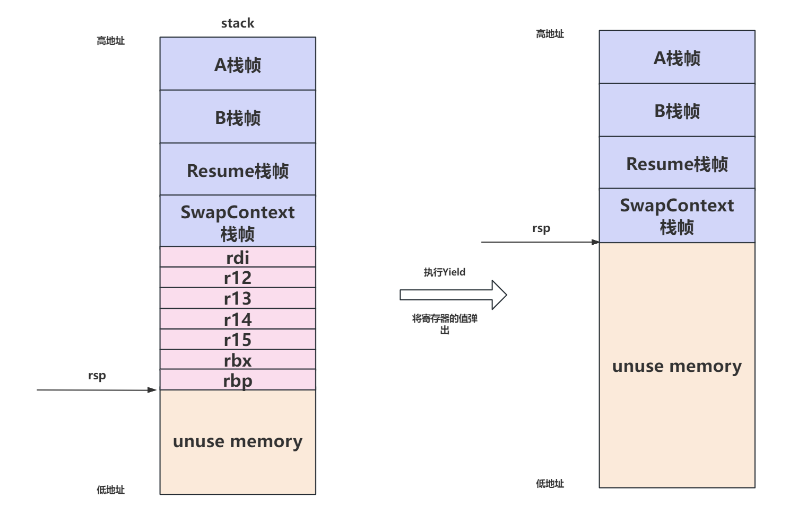

# 协程框架设计

## 1. 什么是协程


- 如上图左边假设一个`MainTask`是一个线程去调用`Task()`函数去执行一个功能，如果`Task()`是一个普通函数，那么`MainTask`会等待`Task()`执行完毕返回后继续执行`MainTask`的步骤
- 如上图右边如果`MainTask`去执行`Cotask()`，而`Cotask()`是一个协程，`Cotask()`在执行的过程中可以通过`yield()`或者`await()`这样的函数暂停自己的执行，并且返回到`MainTask`继续执行，而主函数也可以调用`resume()`这样的函数重新回到`Cotask()`这个协程执行，并不会像函数那样必须执行完毕才返回。这样就做到了用户态的并发，一个线程里可以存在多个协程，并且可以提供一个协程调度器来调度这些协程进行执行。
- 协程实现的关键在于如何在协程切换的时候能够保存当前的执行信息，并且在切换回当前协程时能够恢复执行状态继续往下执行

- 相比于线程，线程是操作系统调度的最小单位，每个线程都会占用cpu时间片，同时需要切换线程上下文，协程在用户态切换，带来的开销会小很多，当然协程只是并发并不是并行。


## 2. CMW的协程实现

在`croutine`文件夹下，总共6个文件


### 2.1 协程上下文

```c++
// 2M的栈大小
constexpr size_t STACK_SIZE = 2 * 1024 * 1024;

#if defined __aarch64__
constexpr size_t REGISTERS_SIZE = 160;
#else
constexpr size_t REGISTERS_SIZE = 56;
#endif

struct RoutineContext {
  char stack[STACK_SIZE];
  char* sp = nullptr;
#if defined __aarch64__
} __attribute__((aligned(16)));
#else
};
#endif
```

- `RoutineContext`为协程运行依赖的上下文，stack标识的是该协程任务依赖的运行栈
- sp标志着当前执行到的栈顶，通过sp可以在切换回协程后，找到上一次程序执行到的地方
- 每个协程都需要有这样一个上下文空间

### 2.2 构建协程

在`croutine.h 、croutine.cpp`中实现了一个协程类`CRoutine`，在`CRoutine`这个类中有几个重要的成员变量

```c++
std::shared_ptr<RoutineContext> context_;
static thread_local CRoutine *current_routine_;
static thread_local char *main_stack_;
```

- `context_`代表当前协程的上下文指针，`current_routine_`指向当前线程的当前协程即自己，`main_stack_`用于保存当前线程的主栈指针


- 在`CRoutine`的构造函数中，会根据配置的component的数量去构建一个`RoutineContext`的对象池，然后从对象池中拿到一个`RoutineContext`用于代表一个协程，然后调用`MakeContext`函数来初始化协程的上下文，构造函数的入口参数为一个`std::function`


- 在`MakeContext`函数里干的事情可以通过下面的图来表示，首先会计算出`sp`的位置为从`栈底-2*sizeof(void*)-REGISTERS_SIZE`，然后将56字节的数据初始化为0，然后填入`f1`和`arg`，


- 进一步`arg`为`CRoutine`的`this`指针，`f1`是`CRoutineEntry`这个函数


### 2.3 协程的执行

协程（非对称）中最核心需要实现resume和yield两个操作。前者让该协程继续执行，后者让协程交出控制权。这里分别是Resume()和Yield()函数。前者最核心做的事就是将上下文从当前切换到目标协程；后者反之。它们都是通过SwapContext()函数实现的上下文切换。我们先来看`Resume()`函数的实现


主要就是调用`SwapContext(GetMainStack(), GetStack());`函数，举个例子比如某线程执行函数

```c++
void funcA(){
	funcB(){
		croutine->Resume();
	}
}
```

线程的栈结构如下：


当`croutine->Resume();`内部调用到`SwapContext(GetMainStack(), GetStack());`时主线程的栈会发生变化，我们接着来看一下`SwapContext`这个函数

```c++
// 协程上下文切换
inline void SwapContext(char** src_sp, char** dest_sp) {
  ctx_swap(reinterpret_cast<void**>(src_sp), reinterpret_cast<void**>(dest_sp));
}
```

调用了`ctx_swap`函数，`ctx_swap`是一个汇编函数：

```assembly
.globl ctx_swap
.type  ctx_swap, @function
ctx_swap:
      pushq %rdi
      pushq %r12
      pushq %r13
      pushq %r14
      pushq %r15
      pushq %rbx
      pushq %rbp
      movq %rsp, (%rdi)

      movq (%rsi), %rsp
      popq %rbp
      popq %rbx
      popq %r15
      popq %r14
      popq %r13
      popq %r12
      popq %rdi
      ret
```

- 一顿`push`往线程的栈里压入了`rdi、r12、r13、r14、r15、rbx、rbp`这七个寄存器，然后使用`movq %rsp, (%rdi)`，`rsp`寄存器此时存储的是主线程的栈指针，`rdi`寄存器根据x86架构的定义用于放置函数的第一个入参，这里就是：

  ```c++
  // 获取当前主栈的地址
  inline char **CRoutine::GetMainStack() { return &main_stack_; }
  ```

  可以看见是当前协程的用于存储线程主栈地址的变量，执行完毕`movq %rsp, (%rdi)`，实际上就是把当前线程主栈的地址用`main_stack_`来保存了，此时主栈的结构如下

  

- 然后执行`movq (%rsi), %rsp` ，`rsi`寄存器存储的是函数的第二个参数，即当前协程的协程栈地址，执行完毕后就是相当与把`rsi`指向的地址的值赋给`rsp`寄存器，这里就是在换栈，从主线程栈切换到协程栈

  ```c++
  inline char **CRoutine::GetStack() { return &(context_->sp); }
  ```

  切换完毕后执行了一堆`pop`指令，把之前构建协程时候初始化的寄存器的值全部恢复到对应寄存器中

  

- 最后执行`ret`指令，`ret`会从栈顶弹出一个值，并将该值加载到指令指针（`RIP`寄存器）中，这个值通常是调用该子程序时保存的返回地址。这个返回地址是子程序返回后执行的指令地址，即子程序调用的下一条指令。这里就是将就是把`CRoutineEntry()`函数的地址弹出来，然后跳过去执行。

  ```c++
      void CRoutineEntry(void *arg){
          CRoutine *r = static_cast<CRoutine *>(arg);
          r->Run();
          CRoutine::Yield(RoutineState::FINISHED);
      }
  ```

  `CRoutineEntry(void *arg)`就一个参数，即保存在`rdi`中的指向当前协程实体的指针，`Run()`函数就会去调用此协程的具体执行体，`func_`这个`std::function`由`CRoutine`的构造函数传入

  ```c++
  inline void CRoutine::Run() { func_(); }
  ```

- 为什么需要保存以上的寄存器，以`x86_64`为例子，我们先来看一下相关寄存器，在`x86_64`的ABI规定里，`rbx,rbp,rsp,r12~r15`是需要`callee`去保存的也就是被调用者，协程的切换本质上就是函数的切换，因此这里需要保存这些寄存器，在这里rsp寄存器的内容被我们保存到了`main_stack_`中，因此除去`rsp`的7个寄存器再加上`rdi`寄存器总共56字节的数据，每个寄存器占用8个字节


### 2.4 协程的挂起

协程可以在运行的过程中自己调用`yield()`函数来使自己暂停执行，然后切换到主线程执行：

```c++
inline void CRoutine::Yield() {
  SwapContext(GetCurrentRoutine()->GetStack(), GetMainStack());
}
```

这里的逻辑和`Resume()`是反过来的，我当前协程正在执行，需要切换到主线程去执行，那么就是保存当前协程运行的上下文，然后换到主线程的栈，恢复主线程的上下文。因此这里`SwapContext`的第一个参数为当前协程的栈指针，第二个参数为之前保存的主线程的栈指针。`CRoutineEntry()`函数为协程的运行主体，在`CRoutineEntry()`函数运行的过程中协程栈的结构如下：


在`CRoutineEntry()`的时候执行`Yieled()`操作，会执行下面的操作：往协程栈里push当前的协程上下文的寄存器信息，然后保存当前协程上下文的栈指针，然后换栈，恢复主线程的上下文，最后跳转回主线程执行

```assembly
.globl ctx_swap
.type  ctx_swap, @function
ctx_swap:
      pushq %rdi
      pushq %r12
      pushq %r13
      pushq %r14
      pushq %r15
      pushq %rbx
      pushq %rbp
      movq %rsp, (%rdi)

      movq (%rsi), %rsp
      popq %rbp
      popq %rbx
      popq %r15
      popq %r14
      popq %r13
      popq %r12
      popq %rdi
      ret
```

协程栈的变化如下图所示：`mov (%rsp), (%rdi)`，会将执行完毕push指令后的协程栈的`rsp`的值保存在`ctx->sp`中


主线程的栈变化如下所示：`movq (%rsi), %rsp`会将rsp设置为主线程的栈地址，从而实现后续的pop工作



这里说一下最后的ret指令：你可能会疑惑我恢复到主线程的栈后，也恢复了主线程的上下文，程序怎么知道我要跳转到哪一行执行呢:

- 这里的关键在于在之前`Resume`时候，`Resume()->SwapContext()->ctx_swap()`，在函数调用过程中，每次调用之前cpu自动将函数的下一条指定的地址压栈，比如从`SwapContext()->ctx_swap()`这样一个函数调用链
- 在执行`ctx_swap()`的那一堆push 和 pop操作之前会先将`ctx_swap()`的下一条指令压栈保存在`SwapContext()`的栈帧中，而`ret`指令会执行的操作就是从栈顶弹出一个地址到`EIP`寄存器中，然后跳转到`EIP`寄存器指向的运行地址执行,这里就是`ctx_swap()`的下一条指令,从而恢复主线程的执行
- 所以协程的切换本质上就是函数的切换，只不过多了那一堆保存协程上下文的操作使得协程能够暂停和继续运行

## 参考链接

- [x86 psABIs / x86-64 psABI · GitLab](https://gitlab.com/x86-psABIs/x86-64-ABI)

- [x86-64中的寄存器_x64汇编 rbx是返回值吗-CSDN博客](https://blog.csdn.net/z974656361/article/details/107125458/)
- [也来说说协程（2）——上下文切换 - 知乎](https://zhuanlan.zhihu.com/p/220025846)
- [什么是协程-CSDN博客](https://blog.csdn.net/sanmi8276/article/details/111375619)
- [CyberRt协程介绍-CSDN博客](https://blog.csdn.net/lizhipengcsdn/article/details/131236278)