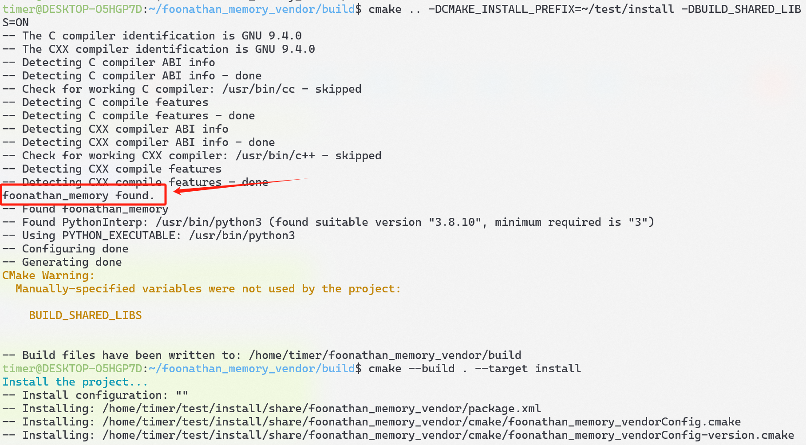
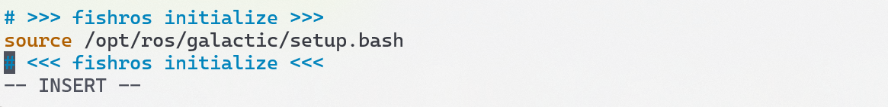

# FastRtps文档

## 1. FastDDS安装

官网：[3. Linux installation from sources — Fast DDS 2.13.1 documentation (eprosima.com)](https://fast-dds.docs.eprosima.com/en/latest/installation/sources/sources_linux.html)

编译安装的过程在上面的官网已经说得十分明白，我在这里说几个编译安装过程中可能遇到的`BUG`

- 对于`OpenEuler`系统，`FastDDS`依赖的一些库需要使用`rpm`包管理器安装

- 编译`FastDDS`所需的`Cmake`版本较高，请先升级`Cmake`版本

- 在安装`Foonathan memory`这个库时，可能会出现如下问题

  

  这里是`cmake`找到了`Foonathan memory`这个库，从而不会去编译源码，导致安装失败，原因在于如果你的主机里安装了`ROS2`，`ROS2`里有`Foonathan memory`相关的`cmake`文件，而`ROS2`里的这个库实际上是个空壳子。为了解决这个问题，只需要在编译`Foonathan memory`时先去把`ROS2`的环境变量注释了，一般来说是在`.bashrc`中，把下面的环境变量注释即可，编译完成后再解除注释

  

- 在编译完成`FastDDS`后可以去跑一下`example`下的`demo`，官方给出的编译方式似乎有点问题，请按照下面这篇博文去做：

  [【FastDDS学习笔记】HelloWorld示例程序编译和运行_fastdds helloword-CSDN博客](https://bylee.blog.csdn.net/article/details/124705821)

  主要的原因就在：`cmake .. -DCMAKE_PREFIX_PATH=~/Fast-DDS/install/` 这里`Cmake`编译时需要加一个路径参数

## 2. FastDDS的版本说明

可以看见`FastDDS`现在的架构有四层`Application`、`DDS`层、`RTPS`层`Transport`层

- `DDS`层是对`RTPS`层的抽象，可以看见`DDS`层里有很多角色，如：`Publisher`、`Subscriber`、`DataWriter`、`DataReader`、`Topic`、`DomainParticipant`等，反而搞得很复杂
- 而`RTPS`层相对而言比较清晰简单`RTPSWriter`用于发送数据，`RTPSReader`用于读取数据，`RTPSParticipant`用于区分不同进程
- `Transport`层则为底层通信实现，可以看见它支持`udp`、`tcp`、`shm`三种通信方式

- `FastDDS`的早期版本其实不叫`FastDDS`，而是直接叫`Fast-Rtps`，意味着早期并没有实现`DDS`协议，并且不支持`shm`，只支持网络通信，`CyberRt`使用的就是以前这种只支持网络通信的版本作为不同主机之间的通讯协议，因此对于同主机之间不同进程的通信，`CyberRt`内部自己实现了基于共享内存的通信方式。

- 对于`cmw`来说，使用的是现在的`FastDDS`即支持共享内存实现了`DDS`协议的版本，不过并没有采用`DDS`层，而是直接使用了`RTPS`层作为不同主机之间的通信，在`cmw`的内部也自己实现了基于共享内存的通信方式，并没有采用`FastDDS`的共享内存通信方式

  官网：[Getting Started — Fast RTPS 1.9.4 documentation (eprosima.com)](https://fast-rtps.docs.eprosima.com/en/v1.9.4/introduction.html)

