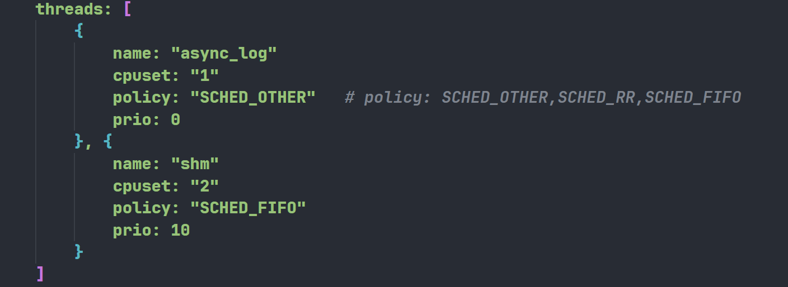

# Scheduler的设计

## 1.代码框架

`cyberrt`的协程调度器的代码是放在`scheduler`目录下的，主要由一下组成：


代码涉及到几个重要的类:

- `sheduler`：调度器基类
- `processor`：抽象的cpu基类
- `processor_context`：抽象cpu的上下文

具体实现的子类：

- `SchedulerClassic`、`SchedulerChoreography`：`sheduler`的子类，代表两种不同的调度器
- `ClassicContext`、`ChoreographyContext`：`processor_context`的子类，代表两种调度器对应的抽象cpu的上下文

这些类的关系如图所示：


## 2.调度器单例

`sheduler`是一个单例，它的实例是通过`scheduler_factory.cpp`中的`Scheduler* Instance()`函数来创建的，我们来看一下这段代码

```c++
namespace {
std::atomic<Scheduler*> instance = {nullptr};
std::mutex mutex;
}  // namespace

Scheduler* Instance() {
  Scheduler* obj = instance.load(std::memory_order_acquire);
  if (obj == nullptr) {
    std::lock_guard<std::mutex> lock(mutex);
    obj = instance.load(std::memory_order_relaxed);
    if (obj == nullptr) {
      std::string policy;
      auto config_file = std::string("cyber/conf/") +
                         GlobalData::Instance()->ProcessGroup() + ".conf";
      apollo::cyber::proto::CyberConfig config;
      if (PathExists(config_file) && GetProtoFromFile(config_file, &config)) {
        AINFO << "Scheduler conf " << config_file << " found and used.";
        policy = config.scheduler_conf().policy();
      } else {
        auto config_path = GetAbsolutePath(WorkRoot(), config_file);
        if (PathExists(config_path) && GetProtoFromFile(config_path, &config)) {
          AINFO << "Scheduler conf " << config_path << " found and used.";
          policy = config.scheduler_conf().policy();
        } else {
          policy = "classic";
          AWARN << "No scheduler conf " << config_file
                << " found, use default.";
        }
      }
      if (!policy.compare("classic")) {
        obj = new SchedulerClassic();
      } else if (!policy.compare("choreography")) {
        obj = new SchedulerChoreography();
      } else {
        AWARN << "Invalid scheduler policy: " << policy;
        obj = new SchedulerClassic();
      }
      instance.store(obj, std::memory_order_release);
    }
  }
  return obj;
}
```

- 可以看见这段代码会去根据配置文件路径读取配置文件，然后根据配置文件中的`policy`字段来`new`对应的`Scheduler`

- 有两种类型的`Scheduler`可以被创建，一种是`SchedulerClassic`，一种是`SchedulerChoreography`，默认会创建`SchedulerClassic`

配置文件的数据结构定义如下：在`cyber/proto/`目录下：

```protobuf
//scheduler_conf.proto
message InnerThread {
  optional string name = 1;
  optional string cpuset = 2;
  optional string policy = 3;
  optional uint32 prio = 4 [default = 1];
}

message SchedulerConf {
  optional string policy = 1;
  optional uint32 routine_num = 2;
  optional uint32 default_proc_num = 3;
  optional string process_level_cpuset = 4;
  repeated InnerThread threads = 5;
  optional ClassicConf classic_conf = 6;
  optional ChoreographyConf choreography_conf = 7;
}

//classic_conf.proto
message ClassicTask {
  optional string name = 1;
  optional uint32 prio = 2 [default = 1];
  optional string group_name = 3;
}

message SchedGroup {
  required string name = 1 [default = "default_grp"];
  optional uint32 processor_num = 2;
  optional string affinity = 3;
  optional string cpuset = 4;
  optional string processor_policy = 5;
  optional int32 processor_prio = 6 [default = 0];
  repeated ClassicTask tasks = 7;
}

message ClassicConf {
  repeated SchedGroup groups = 1;
}

//choreography_conf.proto
message ChoreographyTask {
  optional string name = 1;
  optional int32 processor = 2;
  optional uint32 prio = 3 [default = 1];
}

message ChoreographyConf {
  optional uint32 choreography_processor_num = 1;
  optional string choreography_affinity = 2;
  optional string choreography_processor_policy = 3;
  optional int32 choreography_processor_prio = 4;
  optional string choreography_cpuset = 5;
  optional uint32 pool_processor_num = 6;
  optional string pool_affinity = 7;
  optional string pool_processor_policy = 8;
  optional int32 pool_processor_prio = 9;
  optional string pool_cpuset = 10;
  repeated ChoreographyTask tasks = 11;
}
```

我们举一个具体的例子来说明配置文件：`cyber/conf/example_sched_classic.conf`

```json
scheduler_conf {
    policy: "classic"
    process_level_cpuset: "0-7,16-23" # all threads in the process are on the cpuset
    threads: [
        {
            name: "async_log"
            cpuset: "1"
            policy: "SCHED_OTHER"   # policy: SCHED_OTHER,SCHED_RR,SCHED_FIFO
            prio: 0
        }, {
            name: "shm"
            cpuset: "2"
            policy: "SCHED_FIFO"
            prio: 10
        }
    ]
    classic_conf {
        groups: [
            {
                name: "group1"
                processor_num: 16
                affinity: "range"
                cpuset: "0-7,16-23"
                processor_policy: "SCHED_OTHER"  # policy: SCHED_OTHER,SCHED_RR,SCHED_FIFO
                processor_prio: 0
                tasks: [
                    {
                        name: "E"
                        prio: 0
                    }
                ]
            },{
                name: "group2"
                processor_num: 16
                affinity: "1to1"
                cpuset: "8-15,24-31"
                processor_policy: "SCHED_OTHER"
                processor_prio: 0
                tasks: [
                    {
                        name: "A"
                        prio: 0
                    },{
                        name: "B"
                        prio: 1
                    },{
                        name: "C"
                        prio: 2
                    },{
                        name: "D"
                        prio: 3
                    }
                ]
            }
        ]
    }
}
```

在解析此配置文件的时候会和`proto`文件中定义的字段一一对应起来，关于这个配置文件如何解析的，主要关注`GetProtoFromFile`此函数，在这个函数内部会去解析。

ok现在解析完毕配置文件后可以看见`scheduler_conf`的`policy`字段是`classic`，因此会去新建一个`SchedulerClassic`，接下来我们来看`SchedulerClassic`这个类

## 3.SchedulerClassic

先来看构造函数：

```c++
SchedulerClassic::SchedulerClassic() {
  std::string conf("conf/");
  conf.append(GlobalData::Instance()->ProcessGroup()).append(".conf");
  auto cfg_file = GetAbsolutePath(WorkRoot(), conf);

  apollo::cyber::proto::CyberConfig cfg;
  if (PathExists(cfg_file) && GetProtoFromFile(cfg_file, &cfg)) {
    for (auto& thr : cfg.scheduler_conf().threads()) {
      inner_thr_confs_[thr.name()] = thr;
    }

    if (cfg.scheduler_conf().has_process_level_cpuset()) {
      process_level_cpuset_ = cfg.scheduler_conf().process_level_cpuset();
      ProcessLevelResourceControl();
    }

    classic_conf_ = cfg.scheduler_conf().classic_conf();
    for (auto& group : classic_conf_.groups()) {
      auto& group_name = group.name();
      for (auto task : group.tasks()) {
        task.set_group_name(group_name);
        cr_confs_[task.name()] = task;
      }
    }
  } else {
    // if do not set default_proc_num in scheduler conf
    // give a default value
    uint32_t proc_num = 2;
    auto& global_conf = GlobalData::Instance()->Config();
    if (global_conf.has_scheduler_conf() &&
        global_conf.scheduler_conf().has_default_proc_num()) {
      proc_num = global_conf.scheduler_conf().default_proc_num();
    }
    task_pool_size_ = proc_num;

    auto sched_group = classic_conf_.add_groups();
    sched_group->set_name(DEFAULT_GROUP_NAME);
    sched_group->set_processor_num(proc_num);
  }

  CreateProcessor();
}
```

- 根据配置文件路径解析配置文件

- 根据`scheduler_conf`的`threads`字段填充`inner_thr_confs_`，

  `std::unordered_map<std::string, InnerThread> inner_thr_confs_;`

  

- 根据`scheduler_conf`的`process_level_cpuset`会去调用`Scheduler::ProcessLevelResourceControl()`函数，这个函数是用来配置`cpu`亲和性的，比如”

  `process_level_cpuset: "0-7,16-23" # all threads in the process are on the cpuset`

  `ParseCpuset`会去解析这个字符串知道哪些`cpu`是可以被使用的，然后调用`pthread_setaffinity_np`去设置`cpu`亲和性，经过设置后，当前的线程只会被限制在`[0, 1, 2, 3, 4, 5, 6, 7, 16, 17, 18, 19, 20, 21, 22, 23]`这些`cpu`上执行

  ```c++
  void Scheduler::ProcessLevelResourceControl() {
    std::vector<int> cpus;
    ParseCpuset(process_level_cpuset_, &cpus);
    cpu_set_t set;
    CPU_ZERO(&set);
    for (const auto cpu : cpus) {
      CPU_SET(cpu, &set);
    }
    pthread_setaffinity_np(pthread_self(), sizeof(set), &set);
  }
  ```

- 根据`scheduler_conf`的`classic_conf`去配置任务，如下图，这里配置了两个`group`，在每个`group`内部又有多个`task`，这里的`task`就对应着一个协程，即之前设计的`croutine`

  

- 在解析完成这些配置信息后会去调用`CreateProcessor()`函数，来看看这个函数做了什么事情

  ```c++
  void SchedulerClassic::CreateProcessor() {
    for (auto& group : classic_conf_.groups()) {
      auto& group_name = group.name();
      auto proc_num = group.processor_num();
      if (task_pool_size_ == 0) {
        task_pool_size_ = proc_num;
      }
  
      auto& affinity = group.affinity();
      auto& processor_policy = group.processor_policy();
      auto processor_prio = group.processor_prio();
      std::vector<int> cpuset;
      ParseCpuset(group.cpuset(), &cpuset);
  
      for (uint32_t i = 0; i < proc_num; i++) {
        auto ctx = std::make_shared<ClassicContext>(group_name);
        pctxs_.emplace_back(ctx);
  
        auto proc = std::make_shared<Processor>();
        proc->BindContext(ctx);
        SetSchedAffinity(proc->Thread(), cpuset, affinity, i);
        SetSchedPolicy(proc->Thread(), processor_policy, processor_prio,
                       proc->Tid());
        processors_.emplace_back(proc);
      }
    }
  }
  ```

  - 根据`classic_conf`的`group`数量去遍历，以`group2`为例子，`group2`的配置中设定了`proc_num`的数量为`16`，因此代码中`new`了`16`个`Processor`和`16`个`ClassicContext`，每个`Processor`会绑定一个`ClassicContext`

## 4.Processor

```c++
struct Snapshot {
  std::atomic<uint64_t> execute_start_time = {0};
  std::atomic<pid_t> processor_id = {0};
  std::string routine_name;
};

class Processor {
 public:
  Processor();
  virtual ~Processor();

  void Run();
  void Stop();
  void BindContext(const std::shared_ptr<ProcessorContext>& context);
  std::thread* Thread() { return &thread_; }
  std::atomic<pid_t>& Tid();

  std::shared_ptr<Snapshot> ProcSnapshot() { return snap_shot_; }

 private:
  std::shared_ptr<ProcessorContext> context_;

  std::condition_variable cv_ctx_;
  std::once_flag thread_flag_;
  std::mutex mtx_ctx_;
  std::thread thread_;

  std::atomic<pid_t> tid_{-1};
  std::atomic<bool> running_{false};

  std::shared_ptr<Snapshot> snap_shot_ = std::make_shared<Snapshot>();
};
```

- 可以看见一个`Processor`内部会维护一个线程，因此可以认为一个`Processor`就对应一个线程：`std::thread thread_;`
- 内部还有一个指针有关于指向对应的`context`：`std::shared_ptr<ProcessorContext> context_;`

- 这个`context`指针是在`BindContext`函数调用时传入的：

  ```c++
  void Processor::BindContext(const std::shared_ptr<ProcessorContext>& context) {
    context_ = context;
    std::call_once(thread_flag_,
                   [this]() { thread_ = std::thread(&Processor::Run, this); });
  }
  ```

  `BindContext`函数除了保存传入的指针，还会将`Processor`内部维护的`thread`创建，线程函数为`Processor::Run`

- 我们接着来看看`Run`函数：

  ```c++
  void Processor::Run() {
    tid_.store(static_cast<int>(syscall(SYS_gettid)));
    AINFO << "processor_tid: " << tid_;
    snap_shot_->processor_id.store(tid_);
  
    while (cyber_likely(running_.load())) {
      if (cyber_likely(context_ != nullptr)) {
        auto croutine = context_->NextRoutine();
        if (croutine) {
          snap_shot_->execute_start_time.store(cyber::Time::Now().ToNanosecond());
          snap_shot_->routine_name = croutine->name();
          croutine->Resume();
          croutine->Release();
        } else {
          snap_shot_->execute_start_time.store(0);
          context_->Wait();
        }
      } else {
        std::unique_lock<std::mutex> lk(mtx_ctx_);
        cv_ctx_.wait_for(lk, std::chrono::milliseconds(10));
      }
    }
  }
  ```

  -  `Processor::Run()` 的逻辑很简单，就是不断地调用 `ProcessorContext::NextRoutine()` 函数，取得下一个协程（任务）。如果没取到，就调用 `ProcessorContext::Wait()` 等待。如果取到了，就调用 `CRoutine::Resume()` ，让任务继续运行。
  - 看起来关键是 `NextRoutine()` 是如何挑选下一个任务的。

## 5.ProcessorContext

```c++
class ProcessorContext {
 public:
  virtual void Shutdown();
  virtual std::shared_ptr<CRoutine> NextRoutine() = 0;
  virtual void Wait() = 0;

 protected:
  std::atomic<bool> stop_{false};
};

static constexpr uint32_t MAX_PRIO = 20;

#define DEFAULT_GROUP_NAME "default_grp"

using CROUTINE_QUEUE = std::vector<std::shared_ptr<CRoutine>>;
using MULTI_PRIO_QUEUE = std::array<CROUTINE_QUEUE, MAX_PRIO>;
using CR_GROUP = std::unordered_map<std::string, MULTI_PRIO_QUEUE>;
using LOCK_QUEUE = std::array<base::AtomicRWLock, MAX_PRIO>;
using RQ_LOCK_GROUP = std::unordered_map<std::string, LOCK_QUEUE>;

using GRP_WQ_MUTEX = std::unordered_map<std::string, MutexWrapper>;
using GRP_WQ_CV = std::unordered_map<std::string, CvWrapper>;
using NOTIFY_GRP = std::unordered_map<std::string, int>;

class ClassicContext : public ProcessorContext {
 public:
  ClassicContext();
  explicit ClassicContext(const std::string &group_name);

  std::shared_ptr<CRoutine> NextRoutine() override;
  void Wait() override;
  void Shutdown() override;

  static void Notify(const std::string &group_name);
  static bool RemoveCRoutine(const std::shared_ptr<CRoutine> &cr);

  alignas(CACHELINE_SIZE) static CR_GROUP cr_group_;
  alignas(CACHELINE_SIZE) static RQ_LOCK_GROUP rq_locks_;
  alignas(CACHELINE_SIZE) static GRP_WQ_CV cv_wq_;
  alignas(CACHELINE_SIZE) static GRP_WQ_MUTEX mtx_wq_;
  alignas(CACHELINE_SIZE) static NOTIFY_GRP notify_grp_;

 private:
  void InitGroup(const std::string &group_name);

  std::chrono::steady_clock::time_point wake_time_;
  bool need_sleep_ = false;

  MULTI_PRIO_QUEUE *multi_pri_rq_ = nullptr;
  LOCK_QUEUE *lq_ = nullptr;
  MutexWrapper *mtx_wrapper_ = nullptr;
  CvWrapper *cw_ = nullptr;

  std::string current_grp;
};
```

`ProcessorContext` 类是一个抽象基类，它的实现非常简单，你甚至不用怀疑你的第一直觉，没错，`NextRoutine()` 和 `Wait()` 函数就是它最重要的部分。`ClassicContext`继承了`ProcessorContext`，来看一下构造函数：

```c++
ClassicContext::ClassicContext(const std::string& group_name) {
  InitGroup(group_name);
}

void ClassicContext::InitGroup(const std::string& group_name) {
  multi_pri_rq_ = &cr_group_[group_name];
  lq_ = &rq_locks_[group_name];
  mtx_wrapper_ = &mtx_wq_[group_name];
  cw_ = &cv_wq_[group_name];
  notify_grp_[group_name] = 0;
  current_grp = group_name;
}
```

在新建一个`ClassicContext`时需要传入`group_name`这个，`group_name`就是在`CreateProcessor`中从配置文件中拿到的：


然后调用`InitGroup`函数来初始化一系列的数据结构

```c++
using CROUTINE_QUEUE = std::vector<std::shared_ptr<CRoutine>>;
using MULTI_PRIO_QUEUE = std::array<CROUTINE_QUEUE, MAX_PRIO>;
using CR_GROUP = std::unordered_map<std::string, MULTI_PRIO_QUEUE>;

alignas(CACHELINE_SIZE) static CR_GROUP cr_group_;
```

根据定义可以看见每个`group_name`上都会对应一个`MULTI_PRIO_QUEUE`，这是一个按照优先级排列的数组，数组的每个元素是一个队列`CROUTINE_QUEUE`，队列的每个元素就是具体的协程指针。`CR_GROUP`是用`static`定义的，因此是多个`ClassicContext`公用的


- `CR_GROUP` 相当于组名与优先级队列的表格，是一个全局变量，有序地存放了系统中所有的协程。所以说，在 Classic 策略中，“协程是放在全局的优先级队列中处理的”。
- 每一个协程组与一个 `ClassicContext` 对象对应，一个 `ClassicContext` 也与一个 `Processor` 绑定，即与一个线程绑定。

所以`ProcessorContext`的目的是管理挂在对应的`Processor`的协程组的，我们来看最重要的`NextRoutine() `函数

```c++
std::shared_ptr<CRoutine> ClassicContext::NextRoutine() {
  if (cyber_unlikely(stop_.load())) {
    return nullptr;
  }

  for (int i = MAX_PRIO - 1; i >= 0; --i) {
    ReadLockGuard<AtomicRWLock> lk(lq_->at(i));
    for (auto& cr : multi_pri_rq_->at(i)) {
      if (!cr->Acquire()) {
        continue;
      }

      if (cr->UpdateState() == RoutineState::READY) {
        return cr;
      }

      cr->Release();
    }
  }

  return nullptr;
}
```

- `NextRoutine()`函数就是遍历`CR_GROUP`，按照优先级从高到底遍历，取出对应优先级的协程，如果此协程可以被执行，则返回给`Processor::Run()`函数，会在线程主体里去执行此协程

## 6.线程调度策略和亲和性

我们现在再回到`SchedulerClassic::CreateProcessor()`函数，根据配置文件创建好对应数量的`Processor`和

`ClassicContext`后，会去调用这两个函数：


- 这里是为`Processor`维护的线程设置`cpu`亲和性和调度策略，这里的调度策略是线程的调度策略

线程亲和性设定函数：

```c++
void SetSchedAffinity(std::thread* thread, const std::vector<int>& cpus,
                      const std::string& affinity, int cpu_id) {
  cpu_set_t set;
  CPU_ZERO(&set);

  if (cpus.size()) {
    if (!affinity.compare("range")) {
      for (const auto cpu : cpus) {
        CPU_SET(cpu, &set);
      }
      pthread_setaffinity_np(thread->native_handle(), sizeof(set), &set);
      AINFO << "thread " << thread->get_id() << " set range affinity";
    } else if (!affinity.compare("1to1")) {
      if (cpu_id == -1 || (uint32_t)cpu_id >= cpus.size()) {
        return;
      }
      CPU_SET(cpus[cpu_id], &set);
      pthread_setaffinity_np(thread->native_handle(), sizeof(set), &set);
      AINFO << "thread " << thread->get_id() << " set 1to1 affinity";
    }
  }
}
```

- 可以看见有两种亲和性策略，一种是`range`，一种是`1to1`，`range`的意思是此线程可以在以下的`cpu`上运行，`1to1`的意思是此线程只能在一个相对应的`cpu`上运行

线程调度策略设定函数：

```c++
void SetSchedPolicy(std::thread* thread, std::string spolicy,
                    int sched_priority, pid_t tid) {
  struct sched_param sp;
  int policy;

  memset(reinterpret_cast<void*>(&sp), 0, sizeof(sp));
  sp.sched_priority = sched_priority;

  if (!spolicy.compare("SCHED_FIFO")) {
    policy = SCHED_FIFO;
    pthread_setschedparam(thread->native_handle(), policy, &sp);
    AINFO << "thread " << tid << " set sched_policy: " << spolicy;
  } else if (!spolicy.compare("SCHED_RR")) {
    policy = SCHED_RR;
    pthread_setschedparam(thread->native_handle(), policy, &sp);
    AINFO << "thread " << tid << " set sched_policy: " << spolicy;
  } else if (!spolicy.compare("SCHED_OTHER")) {
    setpriority(PRIO_PROCESS, tid, sched_priority);
    AINFO << "thread " << tid << " set sched_policy: " << spolicy;
  }
}
```

- 这里是设置`Processor`维护的线程操作系统对其的调度策略，根据配置文件传入的信息来配置
- 这里有几种调度策略，分别是`SCHED_FIFO`，`SCHED_RR`，`SCHED_OTHER`，关于这三种策略有什么区别，这里不做详述

## 7.创建任务并执行

你现在可能很疑惑我们根据配置文件依次创建好了需要的线程，设置好了调度策略，cpu亲和性等等，最终目的是为了驱动协程去执行，是不是需要一个函数来创建协程并且放置到对应的`CR_GROUP`里然后唤醒对应的`Processor`去执行，没错确实有这样一个函数，也是`Scheduler`来实现的：`Scheduler::CreateTask`

```c++
bool Scheduler::CreateTask(std::function<void()>&& func,
                           const std::string& name,
                           std::shared_ptr<DataVisitorBase> visitor) {
  if (cyber_unlikely(stop_.load())) {
    ADEBUG << "scheduler is stoped, cannot create task!";
    return false;
  }

  auto task_id = GlobalData::RegisterTaskName(name);

  auto cr = std::make_shared<CRoutine>(func);
  cr->set_id(task_id);
  cr->set_name(name);
  AINFO << "create croutine: " << name;

  if (!DispatchTask(cr)) {
    return false;
  }

  if (visitor != nullptr) {
    visitor->RegisterNotifyCallback([this, task_id]() {
      if (cyber_unlikely(stop_.load())) {
        return;
      }
      this->NotifyProcessor(task_id);
    });
  }
  return true;
}
```

- 此函数的一个参数为协程的执行实体是一个`std::function<void()>`，然后在内部会创建一个协程并进行注册，`GlobalData`内部会维护一个数据结构，里面保存有所有注册的协程的id，创建完毕一个协程即`CRoutine`后会去调用`DispatchTask`函数，此函数负责将协程分发到对应的`Processor`上

```c++
bool SchedulerClassic::DispatchTask(const std::shared_ptr<CRoutine>& cr) {
  // we use multi-key mutex to prevent race condition
  // when del && add cr with same crid
  MutexWrapper* wrapper = nullptr;
  if (!id_map_mutex_.Get(cr->id(), &wrapper)) {
    {
      std::lock_guard<std::mutex> wl_lg(cr_wl_mtx_);
      if (!id_map_mutex_.Get(cr->id(), &wrapper)) {
        wrapper = new MutexWrapper();
        id_map_mutex_.Set(cr->id(), wrapper);
      }
    }
  }
  std::lock_guard<std::mutex> lg(wrapper->Mutex());

  {
    WriteLockGuard<AtomicRWLock> lk(id_cr_lock_);
    if (id_cr_.find(cr->id()) != id_cr_.end()) {
      return false;
    }
    id_cr_[cr->id()] = cr;
  }

  if (cr_confs_.find(cr->name()) != cr_confs_.end()) {
    ClassicTask task = cr_confs_[cr->name()];
    cr->set_priority(task.prio());
    cr->set_group_name(task.group_name());
  } else {
    // croutine that not exist in conf
    cr->set_group_name(classic_conf_.groups(0).name());
  }

  if (cr->priority() >= MAX_PRIO) {
    AWARN << cr->name() << " prio is greater than MAX_PRIO[ << " << MAX_PRIO
          << "].";
    cr->set_priority(MAX_PRIO - 1);
  }

  // Enqueue task.
  {
    WriteLockGuard<AtomicRWLock> lk(
        ClassicContext::rq_locks_[cr->group_name()].at(cr->priority()));
    ClassicContext::cr_group_[cr->group_name()]
        .at(cr->priority())
        .emplace_back(cr);
  }

  ClassicContext::Notify(cr->group_name());
  return true;
}
```

这里设计到几个数据结构：

```c++
std::unordered_map<uint64_t, std::shared_ptr<CRoutine>> id_cr_;
std::unordered_map<std::string, ClassicTask> cr_confs_;
```

首先说一下`cr_confs_`在`SchedulerClassic()`构造函数中会先去赋值：


这里会去读取配置文件中的`task`，设置`task`的`group_name`，有了这个前提后我们再来看`DispatchTask`函数

第一步：装填`id_cr_`:根据id索引

```c++
  {
    WriteLockGuard<AtomicRWLock> lk(id_cr_lock_);
    if (id_cr_.find(cr->id()) != id_cr_.end()) {
      return false;
    }
    id_cr_[cr->id()] = cr;
  }
```

第二步：将要创建的协程任务和配置文件中的`task`对应起来，设置协程的优先级和`group_name`

```c++
  if (cr_confs_.find(cr->name()) != cr_confs_.end()) {
    ClassicTask task = cr_confs_[cr->name()];
    cr->set_priority(task.prio());
    cr->set_group_name(task.group_name());
  } else {
    // croutine that not exist in conf
    cr->set_group_name(classic_conf_.groups(0).name());
  }
```

第三步：将协程放入`cr_group_`中，这样全局的`CR_GROUP`中就能找到此协程了

```c++
  // Enqueue task.
  {
    WriteLockGuard<AtomicRWLock> lk(
        ClassicContext::rq_locks_[cr->group_name()].at(cr->priority()));
    ClassicContext::cr_group_[cr->group_name()]
        .at(cr->priority())
        .emplace_back(cr);
  }
```

第四步：执行`ClassicContext::Notify(cr->group_name());`

```c++
void ClassicContext::Notify(const std::string& group_name) {
  (&mtx_wq_[group_name])->Mutex().lock();
  notify_grp_[group_name]++;
  (&mtx_wq_[group_name])->Mutex().unlock();
  cv_wq_[group_name].Cv().notify_one();
}
```

再执行完毕`DispatchTask`后下一步就是唤醒对应的`Processor`去执行，这也是`Scheduler`去负责的：

```c++
bool Scheduler::NotifyTask(uint64_t crid) {
  if (cyber_unlikely(stop_.load())) {
    return true;
  }
  return NotifyProcessor(crid);
}
```

去调用`NotifyProcessor`函数：

```c++
bool SchedulerClassic::NotifyProcessor(uint64_t crid) {
  if (cyber_unlikely(stop_)) {
    return true;
  }

  {
    ReadLockGuard<AtomicRWLock> lk(id_cr_lock_);
    if (id_cr_.find(crid) != id_cr_.end()) {
      auto cr = id_cr_[crid];
      if (cr->state() == RoutineState::DATA_WAIT ||
          cr->state() == RoutineState::IO_WAIT) {
        cr->SetUpdateFlag();
      }

      ClassicContext::Notify(cr->group_name());
      return true;
    }
  }
  return false;
}
```

调用`ClassicContext::Notify(cr->group_name());`函数

```c++
void ClassicContext::Notify(const std::string& group_name) {
  (&mtx_wq_[group_name])->Mutex().lock();
  notify_grp_[group_name]++;
  (&mtx_wq_[group_name])->Mutex().unlock();
  cv_wq_[group_name].Cv().notify_one();
}
```

ok我们现在再回看`Processor::Run()`函数：如果`context_->NextRoutine()`没有拿到协程则会去调用`context_->Wait()`进行线程阻塞


`ClassicContext::Wait()`做了什么事情呢，实际上就是使用`cw_`的条件变量等待阻塞

```c++
void ClassicContext::Wait() {
  std::unique_lock<std::mutex> lk(mtx_wrapper_->Mutex());
  cw_->Cv().wait_for(lk, std::chrono::milliseconds(1000),
                     [&]() { return notify_grp_[current_grp] > 0; });
  if (notify_grp_[current_grp] > 0) {
    notify_grp_[current_grp]--;
  }
}
```

而`cw_`的值是在`ClassicContext`创建的时候赋值好了会去指向全局的这个静态条件变量


因此上面的`ClassicContext::Notify(cr->group_name());`函数就能去唤醒对应`group`中的一个线程去继续拿协程执行

## 参考链接

- [Apollo Cyber RT 调度系统 - 峰子的乐园](https://dingfen.github.io/2020/10/17/2020-10-17-Cyber RT/)