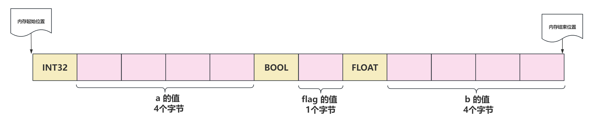
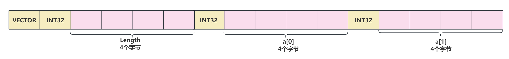

# Cmw序列化机制设计

序列化是将对象的状态信息可以存储或传输的形式的过程。在序列化期间，对象将其状态写入到临时或持久性存储区。以后可以通过从存储区读取或反序列化对象的状态，重新创建此对象

在`cmw`中假设在发送一个自定义的数据结构，需要将这个数据结构发送出去，在网络传输过程，数据的传输是二进制数据，因此我们需要将定义的数据结构转换成二进制数据进行存储，然后发送到网络，接收端在接收到这段二进制数据后，将其反序列化成那个自定义的数据结构

`cmw`中序列化相关的代码实现在`serialize`文件夹中

## 1. Example

在`cmw/serialize/data_stream.h`中定义了一个类`DataStream`，这个类负责了对不同类型的字段的序列化，先来看一下如何使用它

```c++
using namespace std;
#include <cmw/serialize/serializable.h>
#include <cmw/serialize/data_stream.h>

using namespace hnu::cmw::serialize;


enum QosDurabilityPolicy {
  DURABILITY_SYSTEM_DEFAULT = 0,
  DURABILITY_TRANSIENT_LOCAL = 1,
  DURABILITY_VOLATILE = 2,
};


enum RoleType {
  ROLE_NODE = 1,
  ROLE_WRITER = 2,
  ROLE_READER = 3,
  ROLE_SERVER = 4,
  ROLE_CLIENT = 5,
  ROLE_PARTICIPANT = 6,
};

class Data_test : public Serializable
{
public:
    string a;
    uint32_t b;
    RoleType role;
    QosDurabilityPolicy policy = DURABILITY_SYSTEM_DEFAULT;
    int c;
    void show(){
        std::cout << "a:" << a << " b:" << b << " role:" <<(int)role << " c:" << c <<std::endl;
    }
    SERIALIZE(a,b,role,c,policy)
};


class Data_pb : public Serializable
{
public:
    string c;
    Data_test b;
    void show(){
        std::cout << "c:" << c <<std::endl;
    }
    SERIALIZE(c,b)
};

int main()
{

    DataStream ds;
	
    Data_test data;
    data.a = "test";
    data.role = ROLE_CLIENT;
    data.b = 5;
    data.c = 500;


    Data_pb data_test;
    data_test.b = data;
    data_test.c = "test";
    ds << data_test;

    Data_pb data1;

    ds >> data1;
    data1.b.show();
    data1.show();
    return 0;
}
```

- 在上面的代码中定义了`Dara_test`这个类，此类继承`Serializable`这个类，然后使用`SERIALIZE`这个宏将需要序列化的字段列出来
- `Data_pb`同样继承了`Serializable`这个类，因此此类也支持序列化，在`Data_pb`中包含了一个`Dara_test`对象，用于验证序列化的级联
- 在`Main`函数中首先定义了`Data_test`，并填充数据，然后定义`Data_pb`，填充数据，我们调用`ds << data_test`，`ds`这个对象就保存了`Data_pb`序列化后的二进制数据，然后我们新定义一个`Data_pb : data1`，使用`ds >> data1`就可以将序列化后的二进制数据写入了

## 2. 基础数据类型的序列化协议

| 字段类型 | 字段长度（字节） |          底层编码格式          |
| :------: | :--------------: | :----------------------------: |
|   bool   |        2         |       Type(1) + Value(1)       |
|   char   |        2         |       Type(1) + Value(1)       |
|  int32   |        5         |       Type(1) + Value(4)       |
|  uint32  |        5         |       Type(1) + Value(4)       |
|  int64   |        9         |       Type(1) + Value(8)       |
|  uint64  |        9         |       Type(1) + Value(8)       |
|  float   |        5         |       Type(1) + Value(4)       |
|  double  |        9         |       Type(1) + Value(8)       |
|   enum   |        5         |       Type(1) + Value(4)       |
|  string  |     可变长度     | Type(1) +Lenght(5) +  Value(1) |

假设我现在有一个自定义的数据结构体：

```c++
struct Data{
	int a;
	bool flag;
	float b;
}
```

此数据结构经过上面的协议序列化后在内存中存储的结构为：



总共占12个字节，除了将字段的值写入了内存，还会将每个字段的类型写入内存，字段的类型默认为1字节，它们的定义如下，都是枚举变量：

```c++
    enum DataType
    {
        BOOL = 0,  
        CHAR,
        INT32,
        INT64,
        UINT32,
        UINT64,
        FLOAT,
        DOUBLE,
        ENUM,
        STRING,
        VECTOR,
        LIST,
        MAP,
        SET,
        CUSTOM
    };
```

我们通过一个`std::vector<char> m_buf;`来存储这片内存，接下来看看如何将不同类型的数据写入这个`buf`，核心的函数为：

```c++
void DataStream::write(const char * data, int len)
{
    reserve(len);
    int size = m_buf.size();
    m_buf.resize(m_buf.size() + len);
    std::memcpy(&m_buf[size], data, len);
}
```

- `reserve`函数用于判断如果当前`buf`的`size`加上要写入数据的长度大于`vector`的`capacity`，则为`buf`扩容
- 此函数就是将一片`char *`指向的长度为`len`的数据拷贝到`m_buf`之后

### 2.1 数据写入

以写入一个`String`类型的数据为例子：

```c++
void DataStream::write(const string & value)
{
    char type = DataType::STRING;
    write((char *)&type, sizeof(char));
    int len = value.size();
    write(len);
    write(value.data(), len);
} 
```

- 根据上面的序列化协议，首先写入字段的`Type`，占据一个字节，`DataType`是一个枚举变量，将此枚举变量转换为`char`类型的`type`，然后调用上面的`write`函数写入

- 然后存储的是这个`String`变量的长度值，这个长度值被视为一个`int32`的整形，因此占据5个字节，调用`write(len)`这个重载函数来写入一个`int32`类型的数据

  ```c++
  void DataStream::write(int32_t value)
  {
      char type = DataType::INT32;
      write((char *)&type, sizeof(char));
      if (m_byteorder == ByteOrder::BigEndian)
      {
          char * first = (char *)&value;
          char * last = first + sizeof(int32_t);
          std::reverse(first, last);
      }
      write((char *)&value, sizeof(int32_t));
  }
  ```

  `m_byteorder`这个变量是用于控制大小端的。在大端模式下，数据的高位字节存储在低地址处；在小端模式下，数据的低位字节存储在低地址处；在写入`int32`时可以看见根据序列化协议，首先写入`Type`，然后将这个`int32`的整形所占的那边内存挨字节写入

- 最后就是写入`String`的数据，将`String`所占的那边内存拷贝

### 2.2 数据读取

还是以一个`String`类型的数据为例子：

```c++
bool DataStream::read(string & value)
{
    if (m_buf[m_pos] != DataType::STRING)
    {
        return false;
    }
    ++m_pos;
    int len;
    read(len);
    if (len < 0)
    {
        return false;
    }
    value.assign((char *)&(m_buf[m_pos]), len);
    m_pos += len;
    return true;
}
DataStream & DataStream::operator >> (string & value)
{
    read(value);
    return *this; 
}
```

- 首先说明一点假设我现在要写入三个字段；`int a; float b; string c;`；写入时按照什么顺序，读取的时候也得按照对应的顺序

- 读取一个`string`时，首先会判断`m_buf[m_pos]`处存储的字段类型是否匹配，`m_pos`会在`DataSream`构造时初始化为0；如果匹配则去读取该字符串的长度值，调用重载函数

  ```c++
  bool DataStream::read(int32_t & value)
  {
      if (m_buf[m_pos] != DataType::INT32)
      {
          return false;
      }
      ++m_pos;
      value = *((int32_t *)(&m_buf[m_pos]));
      if (m_byteorder == ByteOrder::BigEndian)
      {
          char * first = (char *)&value;
          char * last = first + sizeof(int32_t);
          std::reverse(first, last);
      }
      m_pos += 4;
      return true;
  }
  ```

  这是一个读取`int32`类型数据的重载函数，可以看见还是一样先判断`Type`类型，然后根据序列化协议占据四个字节取出这个`int32`的值，增加`m_pos`，`m_pos`每增加一代表读取的指针对应移动一个字节

- 读取到字符串的长度值后，根据这个长度取出存储的字符数据

## 3. 复合类型序列化协议

| 字段类型         | 字段长度 | 底层编码                                                 |
| ---------------- | -------- | -------------------------------------------------------- |
| `std::vector<T>` | 可变长度 | Type(1) + Length(5)  + Value(T + T +T + ...)             |
| `std::list<T>`   | 可变长度 | Type(1) + Length(5)  + Value(T + T +T + ...)             |
| `std::map<K,V>`  | 可变长度 | Type(1) + Length(5)  + Value((K,V) + (K,V) +(K,V) + ...) |
| `std::set<T>`    | 可变长度 | Type(1) + Length(5)  +  Value(T + T +T + ...)            |

### 3.1 写入数据

**`std::vector<T>`****

```c++
template <typename T>
void DataStream::write(const std::vector<T> & value)
{
    char type = DataType::VECTOR;
    write((char *)&type, sizeof(char));
    int len = value.size();
    write(len);
    for (int i = 0; i < len; i++)
    {
        write(value[i]);
    }
}
```

- 按照上面的序列化协议，首先写入`Type`和和此`vector`中存储的数据的个数

- 然后写入`vector`的每个元素，比如我现在有一个`std::vetor<int> a={ 1 ,2 }`

  

**`std::list<T>`**

```c++
template <typename T>
void DataStream::write(const std::list<T> & value)
{
    char type = DataType::LIST;
    write((char *)&type, sizeof(char));
    int len = value.size();
    write(len);
    for (auto it = value.begin(); it != value.end(); it++)
    {
        write((*it));
    }
}
```

- `list`和`vector`类似，唯一的区别在于取出元素的方式

**`std::map<K,V>`**

```c++
template <typename K, typename V>
void DataStream::write(const std::map<K, V> & value)
{
    char type = DataType::MAP;
    write((char *)&type, sizeof(char));
    int len = value.size();
    write(len);
    for (auto it = value.begin(); it != value.end(); it++)
    {
        write(it->first);
        write(it->second);
    }
}
```

- 对`map`的序列化同样先写入`Type`和`map`中元素的个数，然后一次取出`map`的键值对，先写入键，再写入值

**`std::set<T>`**

```c++
template <typename T>
void DataStream::write(const std::set<T> & value)
{
    char type = DataType::SET;
    write((char *)&type, sizeof(char));
    int len = value.size();
    write(len);
    for (auto it = value.begin(); it != value.end(); it++)
    {
        write(*it);
    }
}
```

- `set`和`vector`类似，没什么好说的

### 3.2 读取数据

以读取一个`map`为例子：

```c++
template <typename K, typename V>
bool DataStream::read(std::map<K, V> & value)
{
    value.clear();
    if (m_buf[m_pos] != DataType::MAP)
    {
        return false;
    }
    ++m_pos;
    int len;
    read(len);
    for (int i = 0; i < len; i++)
    {
        K k;
        read(k);

        V v;
        read(v);
        value[k] = v;
    }
    return true;
}
```

- 先判断`Type`，然后读取`map`中存储的键值对数量，对于每一个键值对，先读取键，再读取值，其他的数据结构同理

## 4. 自定义类的序列化协议

| 字段类型 | 字段长度 | 底层编码                             |
| -------- | -------- | ------------------------------------ |
| 自定义类 | 可变长度 | Type(1)  + Value(D1 + D2 + D3 + ...) |

在上面`example`中提到对自定义的序列化类，需要继承一个接口，然后调用一个宏，例如：

```c++
struct Data : public Serializable
{
	int a;
	bool flag;
	float b;
	SERIALIZE(a , flag , b)
}
```

继承的这个类和这个宏定义在`cmw/serialize/serializable.h`中：

```c++
class Serializable
{
public:
    virtual void serialize(DataStream & stream) const = 0;
    virtual bool unserialize(DataStream & stream) = 0;
};

#define SERIALIZE(...)                              \
                                                    \
    void serialize(DataStream & stream) const       \
    {                                               \
        char type = DataStream::CUSTOM;             \
        stream.write((char *)&type, sizeof(char));  \
        stream.write_args(__VA_ARGS__);             \
    }                                               \
                                                    \
    bool unserialize(DataStream & stream)           \
    {                                               \
        char type;                                  \
        stream.read(&type, sizeof(char));           \
        if (type != DataStream::CUSTOM)             \
        {                                           \
            return false;                           \
        }                                           \
        stream.read_args(__VA_ARGS__);              \
        return true;                                \
    }
```

- 在`Serializable`中定义了两个虚函数，继承此类的子类就具有了这两个接口，子类调用`SERIALIZE`宏，此宏的参数为可变参数类型，宏内部就是对`Serializable`父类定义的虚函数的重载

- 在`serialize`函数内部，首先写入了`Type`，代表为自定义的类，然后调用`write_args`将所有的可变参数都写入

  ```c++
  template <typename T, typename ...Args>
  void DataStream::write_args(const T & head, const Args&... args)
  {
      write(head);
      write_args(args...);
  }
  ```

  可以看见此函数内部是一个个写入可变参数的每一个参数，然后递归调用，直到参数为空，因此需要定义一个无参的`write_args`，因此对一个自定义类的序列化，实际上就是去调用这个类的`serialize`函数

  ```c++
  void DataStream::write_args()
  {
  }
  void DataStream::write(const Serializable & value)
  {
      value.serialize(*this);
  }
  ```

- `unserialize`用于读取数据，首先判断`Type`，然后调用`read_args`

  ```c++
  template <typename T, typename ...Args>
  bool DataStream::read_args(T & head, Args&... args)
  {
      read(head);
      return read_args(args...);
  }
  ```

  和写入的逻辑一样，依次取出每一个参数，然后读取，直到可读取的参数为空，同样对一个自定义类的反序列化就是去调用这个类的`unserialize`函数

  ```c++
  bool DataStream::read_args()
  {
      return true;
  }
  bool DataStream::read(Serializable & value)
  {
      return value.unserialize(*this);
  }
  ```

现在考虑一种情况：

```c++
struct ChangeMSG : public Serializable
{
	int a;
	bool flag;
	float b;
	SERIALIZE(a , flag , b)
}

struct PublishMsg : public Serializable
{
	string name;
    int port;
    string data;
    ChangeMSG change_msg;
	SERIALIZE(name , port ,data ,change_msg)
}
int main(){
    PublishMsg publish_msg;
    DataStream ds;
    ds << publish_msg ;
}
```

- 一个自定义类包含了另一个自定义类，对`PublishMsg`进行序列化时，会先将`name`，`port`，`data`，写入，然后去写`change_msg`，此时就会去调用`change_msg`的`serialize`函数继续级联的写
