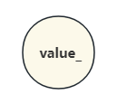
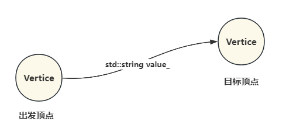
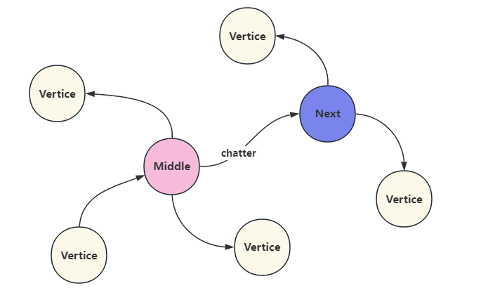
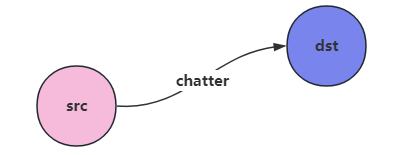
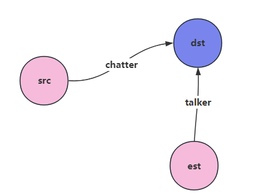
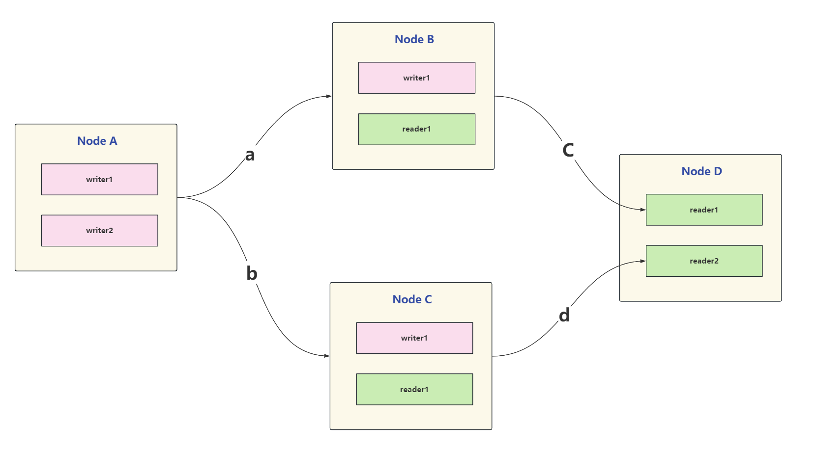
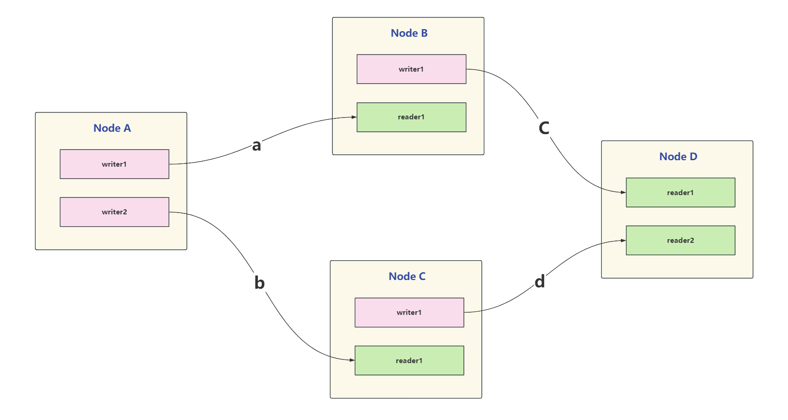
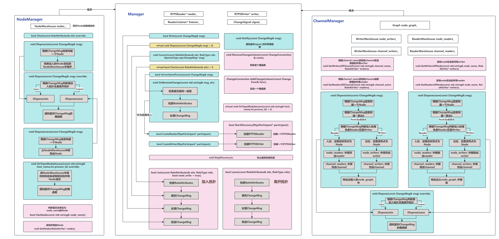

# Cmw的拓扑机制设计

**拓扑结构**是指网络中各个站点相互连接的形式，在cmw中的拓扑简单来说就是当一个新的节点加入时，其他节点能够知道你加入了，维护这样一个拓扑图。当新的节点加入时，他可能是一个发布者也可能是一个订阅者，这个节点需要在真正发布或者订阅数据时先广播自身的信息，这样其他的节点才能知道新加入的这个节点的信息从而建立连接。

## 1.拓扑图中的角色

整个拓扑图中所有的角色都是通过`RoleAttributes`这个结构体来描述的，这个类继承了`Serializable`是支持序列化的

```c++
struct RoleAttributes : public Serializable
{
    std::string host_name;       //主机名
    std::string host_ip;         //主机IP
    int32_t process_id;          //进程ID

    std::string channel_name;    // channel name
    uint64_t channel_id;         // hash value of channel_name

    QosProfile qos_profile;      //Qos配置策略
    uint64_t id;

    std::string node_name;       // node name
    uint64_t node_id;            // hash value of node_name
    
    std::string message_type;    // 消息类型
  SERIALIZE(host_name,host_ip,process_id,channel_name,qos_profile,id,node_name,node_id,message_type)
};
```

在`cmw`中有多种角色：`Node`，`Writer`，`Reader`，`PARTICIPANT`，其中`Server`和`Client`的模式还未实现，

```c++
//通信平面中角色的类型
enum RoleType {
  ROLE_NODE = 1,        // Node
  ROLE_WRITER = 2,      // Publisher
  ROLE_READER = 3,      // Subscriber
  ROLE_SERVER = 4,      // 
  ROLE_CLIENT = 5,
  ROLE_PARTICIPANT = 6,
};
```


在拓扑机制中`Reader`就对应`RTPSReader`，`Writer`就对应`RTPSReader`。在最外层则封装成了`Subsriber`和`Publihser`。

首先在`discovery/role`目录下定义了一个`RoleBase`的类来提供一些操作`Role`的接口，`RoleWriter`和`RoleReader`以及`RoleNode`都是`RoleBase`类型的。

## 2. 拓扑图的底层数据结构

### 2.1 `SingleValueWarehouse`

`SingleValueWarehouse`内部维护了一个`RoleMap`

```c++
using RoleMap = std::unordered_map<uint64_t, RolePtr>;
using RolePtr = std::shared_ptr<RoleBase>;
```

由于`RoleMap`使用的是`unordered_map`，因此键值是不可重复的，是唯一的。向`SingleValueWarehouse`中添加一个`Role`：

```c++
  bool Add(uint64_t key, const RolePtr& role,
           bool ignore_if_exist = true)
```

通过一个唯一的`key`去寻找`Role`

### 2.2 `MultiValueWarehouse`

`MultiValueWarehouse`内部也同样维护了一个`RoleMap`

```c++
using RoleMap = std::unordered_multimap<uint64_t, RolePtr>;
```

由于此时采用的是`unordered_multimap`，是允许键值重复的

### 2.3 `Graph`

首先设计了一个顶点类：`Vertice`，代表图中的一个顶点

 

这个类内部就是维护了一个`std::string value_`用这个`value_`值带代表顶点。

```c++
const std::string& Vertice::GetKey() const { return value_; }
const std::string& value() const { return value_; }
```

对于顶点类来说，它返回的`key`和`value`值都是它内部维护的这个`value_`的值

然后设计了一个边类：`Edge`，代表图中的一条边，，每条边都是有一个出发顶点和目标顶点



但是这个边类有个很奇怪的设计就是：

```c++
const std::string& value() const { return value_; }
std::string Edge::GetKey() const { return value_ + "_" + dst_.GetKey(); }
```

对于一条边来说他的`value`就是`value_`，而返回的`key`是 

然后一张图就是由很多个顶点和边共同组成的：

`Graph`

首先定义了一个顶点的邻接表：

```c++
using VerticeSet = std::unordered_map<std::string, Vertice>;
```


对于`Middle`这个顶点来说，它可能和很多顶点连接在一起，因此使用`VerticeSet`来描述一个顶点与周围顶点的相邻关系，以顶点的`value_`作为`unordered_map`的`key`，

然后在一整张图中每个顶点都有自己的邻接表，因此定义了一个集合用来描述图中所有的邻接表，且这个邻接表是**有向的，只会保存从自身出发指向一个顶点的关系，这也是上面说到为什么那个奇怪的设计，是为了比如对于`middle`这个顶点来说，他的邻接表只会保存` list_["middle"] ["middle_chatter"] = next`  , ` list_["middle"] ["middle_subscribe"] = last`而不会保存从`first`通过`publish`到来那个通道，这个通道交由`first`保存; **

```c++
using AdjacencyList = std::unordered_map<std::string,VerticeSet>;
```

然后定义了一个`EdgeInfo`的用来描述所有边在图中的位置：`EdgeInfo`的`key`就是边的`value_`

```c++
    struct RelatedVertices {
        RelatedVertices() {}
        VerticeSet src;
        VerticeSet dst;
    };
    using EdgeInfo = std::unordered_map<std::string , RelatedVertices>;
```

一条边由两个相邻顶点，因此一条边会包含两个邻接表，比如对于`chatter`这条边来说，他需要知道`Middle`顶点和`Next`顶点的邻接关系才能具体知道这条边在图中的位置。将图中所有边的信息组合在一起就构成了`EdgeInfo`，`EdgeInfo`的`key`就是边的`value_`



有了上面的这些定义，想要描述一张图就和很明显了，至于要一个`EdgeInfo`和一个`AdjacencyList`，即：

```c++
    EdgeInfo edges_;
    AdjacencyList list_;
```

来看一下具体操作图的函数：

向图中插入一条边

```c++
void Graph::Insert(const Edge& e) {
   //判断此边是否为空
  if (!e.IsValid()) {
    return;
  }
  WriteLockGuard<AtomicRWLock> lock(rw_lock_);
  //拿到插入边的value值
  auto& e_v = e.value();
  if (edges_.find(e_v) == edges_.end()) {
    //如果图中没有这条边，则为此边新建一个RelatedVertices
    edges_[e_v] = RelatedVertices();
  }
  //如果此边的出发点不为空，则插入一条出边
  if (!e.src().IsDummy()) {
    InsertOutgoingEdge(e);
  }
   //如果此边的目标点不为空，则插入一条入边
  if (!e.dst().IsDummy()) {
    InsertIncomingEdge(e);
  }
}
```

ok，假设现在图中什么都没有，我有一条边，他的出发顶点和目标顶点都不为空，从`src`到`dst`



则首先`edges["chatter"] = RelatedVertices()`，然后会调用`InsertOutgoingEdge`函数，

```c++
//插入一条出边
void Graph::InsertOutgoingEdge(const Edge& e) {
  
  //拿到出边的value
  auto& e_v = e.value();
  //拿到出边的源顶点的邻接表
  auto& src_v_set = edges_[e_v].src;
  //拿到出边的源顶点
  auto& src_v = e.src();
  //拿到出边源顶点的key
  auto& v_k = src_v.GetKey();
   //如果源顶点的邻接表不是空的则返回
  if (src_v_set.find(v_k) != src_v_set.end()) {
    return;
  }
  //代表指向自己
  src_v_set[v_k] = src_v;

  auto& dst_v_set = edges_[e_v].dst;
  Edge insert_e;
  insert_e.set_src(src_v);
  insert_e.set_value(e.value());
  for (auto& item : dst_v_set) {
    insert_e.set_dst(item.second);
    InsertCompleteEdge(insert_e);
  }
}
```

- e_v = "chatter"    
- src_v_set = edges_["chatter"].src  // src 顶点的邻接表
- src_v = e.src         //   src 顶点
- v_k = "src"           //    src 顶点的 key 
- src_v_set[v_k] = src_v; ----->  edges_["chatter"] ["src"] = e.src      //给边`chatter`的源顶点的邻接表赋值
- dst_v_set = edges_["chatter"].dst;      //此时 edges_["chatter"].dst 是空的，所以不会进入for循环去执行`InsertCompleteEdge`函数

然后会调用`void InsertIncomingEdge(const Edge& *e*);`

```c++
//插入一条入边
void Graph::InsertIncomingEdge(const Edge& e){
    //拿到入边的value
    auto& e_v = e.value();
    //拿到入边的目标顶点的连接表
    auto& dst_v_set = edges_[e_v].dst;
    //拿到入边的目标顶点
    auto& dst_v = e.dst();
    //拿到入边的目标顶点的value
    auto& v_k = dst_v.GetKey();

    if(dst_v_set.find(v_k) != dst_v_set.end()){
        return;
    }
    //代表指向自己
    dst_v_set[v_k] = dst_v;

    //拿到入边的出发顶点
    auto& src_v_set = edges_[e_v].src;
    //插入一条完整的边
    Edge insert_e;
    insert_e.set_dst(dst_v);
    insert_e.set_value(e.value());
    for(auto& item : src_v_set){
        insert_e.set_src(item.second);
        InsertCompleteEdge(insert_e);
    }
}
```

- e_v = "chatter"    
- dst_v_set = edges_["chatter"].dst  // dst 顶点的邻接表
- dst_v =  e.dst   // dst 顶点
- v_k = "dst"           //    dst 顶点的 key 
- dst_v_set[v_k] = dst_v     -------> edges_["chatter"] ["dst"] = e.dst //给边`chatter`的目标顶点的邻接表赋值
- src_v_set = edges_[e_v].src;     //src顶点的邻接表，此时不为空，因此会进入下面的for循环去插入边

```c++
//插入一条完整的边
void Graph::InsertCompleteEdge(const Edge& e)
{
    //拿到插入边的出发顶点的value
    auto& src_v_k = e.src().GetKey();
    //如果没有找到此顶点的邻接表，则新建一个新的邻接表
    if(list_.find(src_v_k) == list_.end()){
        list_[src_v_k] = VerticeSet();
    }

    //拿到插入边的终点的value
    auto& dst_v_k = e.dst().GetKey();
    //如果没有找到此顶点的邻接表，则新建一个新的邻接表
    if(list_.find(dst_v_k) == list_.end()){
        list_[dst_v_k] = VerticeSet();
    }

    //
    list_[src_v_k][e.GetKey()] = e.dst();
}
```

- src_v_k = "src"
- list_["src"] = VerticeSet()
- dst_v_k = "dst"
- list_["dst"] = VerticeSet()
- list_["src"] ["chatter_dst"] = e.dst  //这里很奇怪，

完成了上面的步骤后

 edges_["chatter"] ["dst"] = e.dst

 edges_["chatter"] ["src"] = e.src 

 list_["src"] ["chatter_dst"] = e.dst 

list_["dst"] = VerticeSet()

假设我现在又插入一条边：



edges["talker"] ["est"] = est

edges["talker"] ["dst"] = dst

list_["est"] ["talker_dst"] = dst 

list_["dst"] = VerticeSet()

插入的逻辑就如上分析

然后是图的搜索：使用广度优先搜索算法遍历，判断是否有从`start`出发到`end`的路径：

```c++
//广度优先搜索（BFS）算法遍历图，
bool Graph::LevelTraverse(const Vertice& start, const Vertice& end) {
  std::unordered_map<std::string, bool> visited; 
  visited[end.GetKey()] = false;  //将结束顶点标记为未访问
  std::queue<Vertice> unvisited;  
  unvisited.emplace(start);       //将起始顶点放入待访问队列。
  while (!unvisited.empty()) {
    auto curr = unvisited.front(); //从待访问队列中取出队首的顶点。
    unvisited.pop();               //将已访问的顶点从待访问队列中移除。
    if (visited[curr.GetKey()]) {  //如果当前顶点已经被访问过，则跳过该次循环。
      continue;
    }
    visited[curr.GetKey()] = true;  //将当前顶点标记为已访问。
    if (curr == end) {              //如果当前顶点是结束顶点，则退出循环，表示找到了从起始顶点到结束顶点的路径
      break;
    }
    for (auto& item : list_[curr.GetKey()]) {  //将当前顶点的邻居顶点加入待访问队列。
      unvisited.push(item.second);
    }
  }
  return visited[end.GetKey()];    //返回一个布尔值，表示是否存在从起始顶点到结束顶点的路径。
}
```

## 4. 拓扑图的管理

### 4.1 拓扑结构

假设我现在整个通信平面中有四个`Node`：各个节点间的连接关系如下

  **A---a--->B---c----->D**

 **|                             |**

  **----b--->C-----d----->**



每个节点会维护着上面这样一个图，注意图的顶点是`Node`，而不是`Node`内部的`writer`或者`reader`，除了维护上面这样一个图外，由于每个Node中有多个`writer`或者`reader`，因此内部还需要一个数据结构来存储图中的每个`Node`内部的`writer`或者`reader`，每个角色有自己的`channel_name`。

每个角色加入时都会广播自己的消息，已在图中的节点就会根据这个广播的消息更新这张图，比如现在`Node D`中的一个新添加一个`reader3`用于接收`channel c`来的消息，加入时广播的消息结构体即为上面提到的`ChangeMsg`:

```c++
struct ChangeMsg : public Serializable
{
    uint64_t timestamp;  
    ChangeType change_type ;
    OperateType operate_type;
    RoleType role_type;
    RoleAttributes role_attr;

    SERIALIZE(timestamp,change_type,operate_type,role_type,role_attr)
};
显而易见此时：
    role_type = ROLE_READER;
	operate_type = OPT_JOIN;
	change_type = CHANGE_CHANNEL;
	role_attr.channel_name = "c";
    role_attr.channel_id = Hash(role_attr.channel_name);
	role_attr.node_name = "D";
	role_attr.node_id = Hash(role_attr.node_name);
```

通过广播上面的消息，其他节点就知道了是一个新的属于`Node D`的`reader`加入拓扑图了



### 4.2 拓扑机制设计

先看下面这张软件架构图，有一个总的`Manager`的基类，两个子类`NodeManager`和`channelManager`，我们主要用到的子类是`channel_manager`，`channel_manager`内部就会维护这个拓扑图



上面软件架构图中，蓝色的接口为私有接口，黄色的是虚函数，需要子类重载，粉红色的接口为公有接口

先前提到由于当新的角色加入时需要广播信息，其他已经在拓扑图中的角色需要接收信息，因此借助`FastRtps`来实现通信，在`Manager`中可以看见定义了：

```c++
eprosima::fastrtps::rtps::RTPSWriter* writer_;   //用于发送广播信息
eprosima::fastrtps::rtps::RTPSReader* reader_;   //用于接收广播信息
```

- `channel_manager`中`rtps writer`和 `reader`发送和接收的`ChangeMsg`的`channel_name`为``"channel_change_broadcast"``

- `RtpsWriter`和`RtpsReader`是在`StartDiscovery`中创建的，这里值得注意的的是在创建`RtpsReader`绑定的回调函数为`OnRemoteChange`，而在回调函数的内部则去调用了`Dispose`函数，这个函数就是用来更新图的。对于一个已经存在于拓扑图中的节点来说，当其他节点加入或者离开拓扑图中时，会向`"channel_change_broadcast"`这个`channel`广播新加入的角色的`ChangeMsg`，此时就会触发此节点`RtpsReader`的回调，即去执行`OnRemoteChange`函数，实际上就是去执行`Dispose`函数，`Dispose`函数内部去解析`ChangeMsg`，这样就知道具体是图中的那个角色发生了改变，从而动态的更新拓扑图。

- 当一个新的角色加入时，只需要在定义好角色的相关属性后，调用`ChannelManager`的`Join`函数即可，`Join`函数内部会先调用`Convert`去填充需要发送的`ChangeMsg`，然后调用`Dispose`函数根据`ChangeMsg`中的信息来更新拓扑图，然后将`ChangeMsg`通过在`Manager`中定义的`RtpsWriter`广播出去。
- 当一个新的角色离开时，也是类似，根据要离开角色的信息调用`ChannelManager`的`Leave`函数即可，同样`Leave`函数内部会先调用`Join`函数内部会先调用`Convert`去填充需要发送的`ChangeMsg`，然后调用`Dispose`函数根据`ChangeMsg`中的信息来更新拓扑i图，和`Join`不同的地方在于此时图中就会删除边了，然后将`ChangeMsg`通过在`Manager`中定义的`RtpsWriter`广播出去。

`Dispose`函数是由子类重载的，根据`ChangeMsg`中的`operate_type`来判断改变的角色是加入还是离开，如果是加入则执行`DisposeJoin`函数，如果是离开则执行`DisposeLeave`函数。在`ChannelManager`中定义了五个数据结构来维护这个拓扑机制：

```c++
    using WriterWarehouse = MultiValueWarehouse;   //键值允许重复的map
    using ReaderWarehouse = MultiValueWarehouse;  //
	//拓扑图数据结构
	Graph node_graph_;
    // key: node_id
    WriterWarehouse node_writers_;
    ReaderWarehouse node_readers_;
    // key: channel_id
    WriterWarehouse channel_writers_;
    ReaderWarehouse channel_readers_;
```

以`DisposeJoin`为例子来看看如何维护这个拓扑机制的，`DisposeLeave`同理

```c++
void ChannelManager::DisposeJoin(const ChangeMsg& msg){
    ScanMessageType(msg);

    //以Node作为顶点
    Vertice v(msg.role_attr.node_name);

    Edge e;
    //以channel_name作为边
    e.set_value(msg.role_attr.channel_name);

    //把writer作为出发顶点，reader作为目标顶点
    if(msg.role_type == RoleType::ROLE_WRITER){
        //
        auto role = std::make_shared<RoleWriter>(msg.role_attr, msg.timestamp);
        node_writers_.Add(role->attributes().node_id , role);
        channel_writers_.Add(role->attributes().channel_id, role);
        //设置此边的出发顶点
        e.set_src(v);
    } else {
        auto role = std::make_shared<RoleReader>(msg.role_attr , msg.timestamp);
        node_readers_.Add(role->attributes().node_id, role);
        channel_readers_.Add(role->attributes().channel_id, role);
        //设置此边的目标顶点
        e.set_dst(v);
    }
    //将此边加入图中
    node_graph_.Insert(e);
}
```

- 首先以角色所属的`Node`构造一个顶点
- 然后构造一条边，边的属性值即为角色绑定的`channel_name`
- 根据`role_type`判断加入的角色是`writer`还是`reader`，如果是`writer`则代表新加入一条出边，如果是一条`reader`则代表新加入一条入边
- 一个`Node`中可能包含多个`writer`和`reader`，以`node_id`作为`key`，添加`writer`或者`reader`到`node_writers_`和`node_readers_`这两张表中，整个拓扑图中所有的`reader`和`writer`都可以通过这两张表来查找
- 同样一个`channel`可能也连接了多个`reader`和`writer`，所以用`channel_writers_`这`channel_readers_`这两张表来保存
- 最后将边的信息加入拓扑图`node_graph_`中