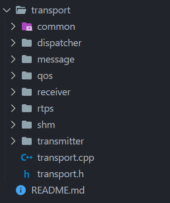
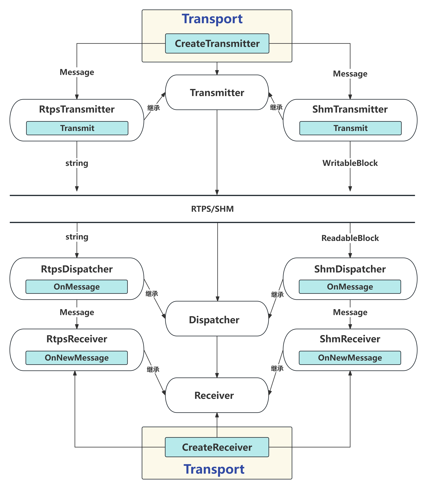
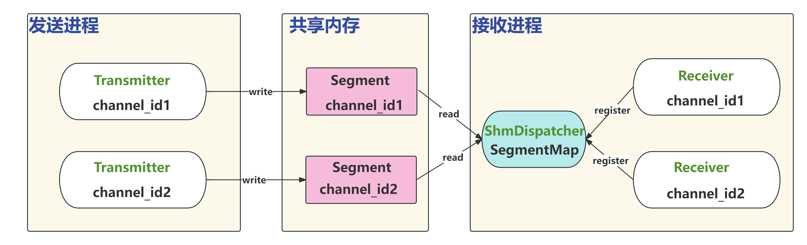
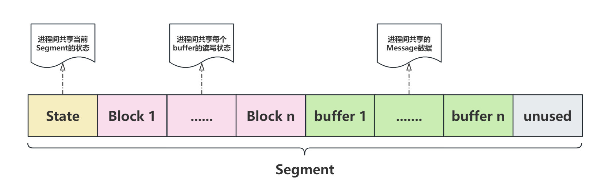
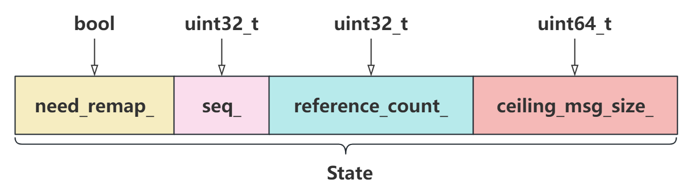
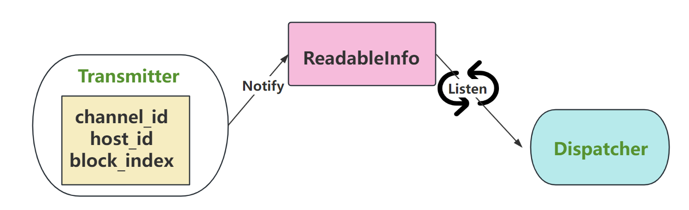
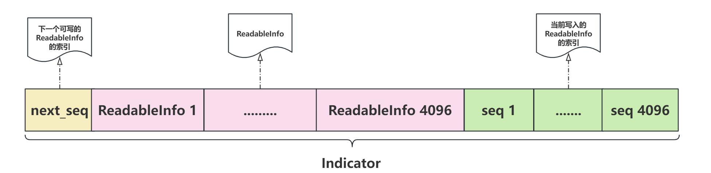
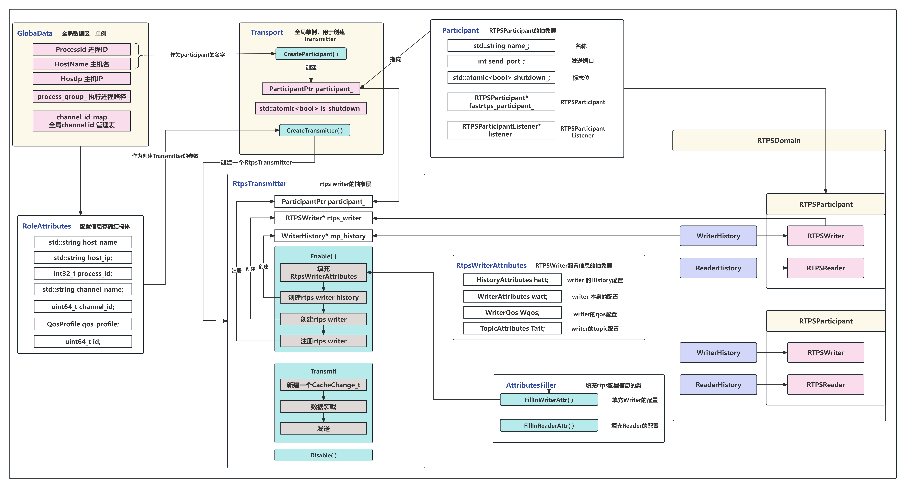
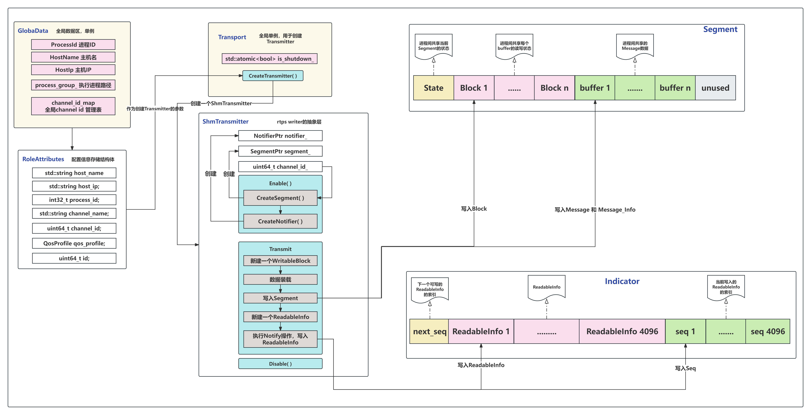

# Cmw的Transport层设计

## 1. 通信整体机构

`cmw`的`Transport`层设计比较复杂，整体通信流程如下图所示：

**代码**：



**发送方**：

- 在发送方通过`Transport`的`CreateTransmiter`函数可以创建两种类型的`Transmitter`：基于`FastRtps`的和基于`Shm`的，通过`Transmitter`的`Transmit`函数就可以将`Message`消息发送出去
- `Message`为自定义的消息数据类型，通过`cmw`中提供的`serialize`序列化库就可以将自定义的数据类型序列化成一段字节数据流
- 对于`RtpsTransmitter`，会将`Message`序列化成`string`类型的数据，然后传递给`FastRtps`的`writer`发送出去；对于`ShmTransmitter`会将`Message`存储在一个名为`WritableBlock`的内存块中，然后通过`Shm`的方式去拿到这个`ReadableBlock`共享内存块，从而获取`Message`

**接收方**：

- 接收方通过`Transport`的`CreateReceiver`函数可以创建两种类型的`Receiver`;和`Transmitter`一样，支持基于`FastRtps`和`Shm`的通信方式
- 和发送方的主动发送数据不同，接收方是被动的，只有当监测到有数据发出后，接收方才会去接收数据，并去执行回调函数处理数据。
- 监测数据到来的逻辑则是在`Dispatcher`中实现，当发送方发送数据后，`Dispatcher`监测到数据到来时会去执行`Onmessage`函数，此函数会将数据发序列化成`Message`类型，然后会调用`Receiver`的`OnNewMessage`，在`OnNewMessage`函数中会去执行数据接收方注册的回调函数



**代码示例**：测试用例在`cmw/example`目录下

- ```c++
  // test_writer.c
  // 使用SHM的方式发送ChangeMsg类型的数据
  #include <cmw/config/topology_change.h>
  #include <cmw/time/time.h>
  void TEST_ChangeMsg()
  {
      using namespace hnu::cmw::config;
      using namespace hnu::cmw;
      using namespace hnu::cmw::common;
      using namespace hnu::cmw::transport;
      std::cout <<"---------------------Transport Transmitter Test---------------------" << std::endl;
      //填充发送端相关配置信息
      RoleAttributes attr;
      attr.channel_name = "exampleTopic";  //发送的channel_name
      attr.host_name = GlobalData::Instance()->HostName();
      attr.host_ip = GlobalData::Instance()->HostIp();
      attr.process_id =  GlobalData::Instance()->ProcessId();
      attr.channel_id = GlobalData::Instance()->RegisterChannel(attr.channel_name);
      QosProfile qos;
      attr.qos_profile = qos;
  	//填充要发送的数据
      ChangeMsg change_msg;
      change_msg.timestamp = Time::Now().ToNanosecond();
      std::cout << "time: " << change_msg.timestamp << std::endl;
      change_msg.change_type = CHANGE_NODE;
      change_msg.operate_type = OPT_JOIN;
      change_msg.role_type = ROLE_WRITER;
      change_msg.role_attr = attr;
  	//创建transmitter
      auto transmitter = Transport::Instance()->CreateTransmitter<ChangeMsg>(attr,OptionalMode::SHM);
  	//创建ChangeMsg的数据指针
      std::shared_ptr<ChangeMsg> msg_ptr = std::make_shared<ChangeMsg>(change_msg);
      //创建MessageInfo
      MessageInfo msg;
      uint64_t n = 0;
      while (1)
      {
          msg.set_seq_num(n);
          std::cout<<"seq: " << n << std::endl;
          n++;
          //发送数据
          transmitter->Transmit(msg_ptr, msg);
          std::this_thread::sleep_for(std::chrono::milliseconds(250));
      }
  }
  int main()
  {
      Logger_Init("writer.log");
      TEST_ChangeMsg();
      return 0;
  }
  ```

- ```c++
  //test_reader.c
  //使用SHM的方式接收ChangeMsg
  #include <cmw/common/global_data.h>
  #include <cmw/config/RoleAttributes.h>
  #include <cmw/transport/dispatcher/rtps_dispatcher.h>
  #include <cmw/common/util.h>
  #include <cmw/transport/receiver/receiver.h>
  #include <cmw/transport/transport.h>
  void TEST_ChangeMsg()
  {
      //填充接收端的配置信息
      RoleAttributes attr;
      attr.channel_name = "exampleTopic";
      attr.host_name = GlobalData::Instance()->HostName();
      attr.host_ip = GlobalData::Instance()->HostIp();
      attr.process_id =  GlobalData::Instance()->ProcessId();
      attr.channel_id = GlobalData::Instance()->RegisterChannel(attr.channel_name);
      QosProfile qos;
      attr.qos_profile = qos;
  	//创建回调函数
      auto listener1 = [](const std::shared_ptr<ChangeMsg>& message ,
                         const MessageInfo& info, const RoleAttributes&){
                          std::cout<<"time: " << message->timestamp << "operate_type:"  << message->operate_type << "seq:" << info.seq_num() << std::endl;  
                         };
      //创建receiver
      auto shm_receiver=Transport::Instance()->CreateReceiver<ChangeMsg>(attr,listener1,OptionalMode::SHM);
      printf("Press Enter to stop the Reader.\n");
      std::cin.ignore();
  }   
  
  int main()
  {
      Logger_Init("reader.log");
      TEST_ChangeMsg();
      return 0;
  }
  ```

## 2. 底层通信机制

通信逻辑如下：

- 对于同主机的同一进程而言，由于同一进程的内存是没有相互隔离的，因此直接通过指针，全局变量的方式通信即可，我们不考虑这种情况；

- 对于同主机的不同进程来说，就可以采用共享内存的方式来实现高效的通信
- 对于不同主机间的进程就只有使用`RTPS`来通过网络进行数据传输了


### 2.1 FastRtps通信

关于`FastRtps`的通信方式以及逻辑，请参考如下的文章：

> [DDS与FastRTPS（一）-阿里云开发者社区 (aliyun.com)](https://developer.aliyun.com/article/1134960)
>
> [DDS与FastRTPS（二）-阿里云开发者社区 (aliyun.com)](https://developer.aliyun.com/article/1134961)

去过一遍管饭提供的`example`就能明白是如何工作的了

### 2.2 Shm通信

基于`shm`的通信代码目录为：`cmw/transport/shm`

**通信流程**



- 在发送方`ShmTransmitter`会根据`channel_id`创建一个`Segment`，这个`Segment`就是独属于`channel_id`的一片共享内存，写数据就是去写这片内存；
- 接收方的`ShmDispatcher`是一个单例，当`Receiver`想要接收某个`channel_id`来的数据，会先向`ShmDispathcer`注册，而`ShmDispathcer`内部有一个`SegmentMap：<channel_id, Segment>`，通过索引`channel_id`就能找到发送进程创建的对应的`Segment`，从而拿到数据

#### 2.2.1 消息内存结构

**`Segment`的内存结构**: 



- 每个`Segment`共享的内容有
  - 一个`State` 
  - `n`个`Block`
  - `n`个`buffer`

- 一个`Segment`的大小由`msg`的大小来决定，具体的规则定义在：`cmw/transport/shm/shm_conf`中，具体规则如下：比如如果传递的一条`msg`大小在`10k-100k`，则`Segment`的`Block`个数为`128`，一个`msg`的大小为`1024 * 128 = 128k`，`buf`的个数也为`128`。而一个`buf`由两部分组成：

  

  `MessageInfo`的大小固定为1024个字节，因此此时一个`buf`的大小就是`128k + 1k = 129k`，发送端就往这个`Segment`中写数据，一条数据占据一个`buf`，相当于一个写的队列，当超出队列长度后又会重头开始写。

  `Segment`创建共享内存时的大小为，`EXTRA_SIZE`就是上面灰色的未使用的部分

  ```c++
  // 4K + 1K + 1K + (1K + 129k) * 128
  EXTRA_SIZE+ STATE_SIZE + (BLOCK_SIZE + block_buf_size_) * block_num_
  ```

  ```c++
    // Extra size, Byte
     const uint64_t ShmConf::EXTRA_SIZE = 1024 * 4;
    // State size, Byte
     const uint64_t ShmConf::STATE_SIZE = 1024;
    // Block size, Byte
     const uint64_t ShmConf::BLOCK_SIZE = 1024;
    // Message info size, Byte
     const uint64_t ShmConf::MESSAGE_INFO_SIZE = 1024;
    // For message 0-10K
     const uint32_t ShmConf::BLOCK_NUM_16K = 512;
     const uint64_t ShmConf::MESSAGE_SIZE_16K = 1024 * 16;
    // For message 10K-100K
     const uint32_t ShmConf::BLOCK_NUM_128K = 128;
     const uint64_t ShmConf::MESSAGE_SIZE_128K = 1024 * 128;
    // For message 100K-1M
     const uint32_t ShmConf::BLOCK_NUM_1M = 64;
     const uint64_t ShmConf::MESSAGE_SIZE_1M = 1024 * 1024;
    // For message 1M-6M
     const uint32_t ShmConf::BLOCK_NUM_8M = 32;
     const uint64_t ShmConf::MESSAGE_SIZE_8M = 1024 * 1024 * 8;
    // For message 6M-10M
     const uint32_t ShmConf::BLOCK_NUM_16M = 16;
     const uint64_t ShmConf::MESSAGE_SIZE_16M = 1024 * 1024 *16;
    // For message 10M+
     const uint32_t ShmConf::BLOCK_NUM_MORE = 8;
     const uint64_t ShmConf::MESSAGE_SIZE_MORE = 1024 * 1024 * 32;
  ```

- `State`的定义：`cmw/transport/shm/state.h`

  - 一个`State`包含四个原子变量，所以他们都是进程安全的
  - `need_remap`代表这个`Segment`是否需要重新映射
  - `ceiling_msg_size`代表`msg`的大小即一个`buf`的字节数，当然一个`buf`的大小根据上面的规则肯定是`>= `一条消息的大小，从上面的规则可以看出，`msg`越大，队列长度越短。
  - `seq_`代表的是当前正在写的`block`的索引，发送端每发送一条消息就会去写入一个`Block`和一个`buf`，每次写完数据后就会将`seq+1`
  - `reference_count`代表使用这片内存的用户的个数

  

- `Block`的定义：`cmw/transport/shm/block.h`

  - `lock_num_`是一个原子变量，此原子变量用于控制`Block`对应的那个`buf`的读写互斥，用于做到进程间的安全读写
  - `msg_size`__和`msg_info_size_`就是消息的长度了，不用多说
  
  

> 共享内存的创建有在`Linux`下有两种方式，一种是基于`posix`标准的，一种是基于`System v`，因此有两种方式来创建一个`Segment`，分别对应`shm/posix_segment`和`shm/xsi_segment`，默认创建方式为`xsi_segment`

**写入数据**：

- 当`Transmitter`需要发送信息时，先会创建一个`Segment`，然后从此`Segment`中取出一个可以写的`WritableBlock`，然后写入数据；`WritableBlock`定义如下：

  ```c++
  //可写的块内存结构体
  struct WritableBlock
  {
      uint32_t index = 0;
      Block* block = nullptr;
      uint8_t* buf = nullptr;
  };
  ```

  一个`Block`对应一个`buf`，`Block`描述了对应的`buf`的信息，将`Block`和`buf`组成一对再加上索引`index`就构成了一个`WritableBlock`；如果要写入`msg`大小超过当前`Block`的`ShmConf::MESSAGE_SIZE_n`，会触发`remap`，即让当前`Segment`重新创建更大的内存，其他进程使用此`Segment`时依然再读取旧的共享内存的`State`，会触发`remap`，然后会重新打开创建的更大的内存。实际上`Segment`被创建时默认使用最小的`ShmConf::MESSAGE_SIZE_16K`，所以如果大于这个的`msg`在第一次写入时都触发`remap`;

#### 2.2.2 消息通知机制

当发送方写完数据后，需要通知接收方表明有新的数据了，接收方会一直轮询监听此通知，当收到有新的数据发送了就会去处理数据；机制和上面通过共享内存发送数据的模式相似。在`cmw`中实现了两种通知机制，一种是基于共享内存的，一种是基于网络的。



**消息通知结构体**：

- 发送方通知接收方的数据结构定义为`ReadableInfo`，由`channel_id`、`host_id`、`block_index`三部分组成，在发送方写完数据后会填充一个`ReadableInfo`，然后发送出去
- 接收方会先比对发送方传来的`host_id`，用于判断发送方和接收方是否在同一主机
- 发送方需要告诉接收方写数据的`channel_id`是多少，这样接收方就能根据此`channel_id`找到对应的`Segment`
- 接收方再找到`channel_id`对应的`Segment`后，再根据`block_index`去索引就能打到对应的`buf`了

**基于共享内存的消息通知**：`cmw/transport/shm/condition_notifier`

- `ConditionNotifier`是一个单例，因此无论发送方由多少个`Transmitter`，都只会通过这一个`Notifier`来通知

- `ConditionNotifier`会开辟一片共享内存，此共享内存的`key`是确定的，因此即使在同一台主机上有多个进程，只要第一个进程开辟了名为`key_`的共享内存，其余进程只需要打开然后映射就可使用了，所以这个`Indicator`是当前主机上所有进程共享的

  ```c++
  key_ = static_cast<key_t>(Hash("/hnu/cmw/transport/shm/notifier"));
  ```

- 此内存结构构成如下：

  ```c++
  const uint32_t kBufLength = 4096;
  struct Indicator{
          std::atomic<uint64_t> next_seq = {0};
          ReadableInfo infos[kBufLength];
          uint64_t seqs[kBufLength] = {0};
      };
  ```

  

- 通知更新：

  ```c++
  bool ConditionNotifier::Notify(const ReadableInfo& info){
      if(is_shutdown_.load()){
          ADEBUG << "notifier is shutdown.";
          return false;
      }
      //先取到next_seq，再对next_seq+1
      uint64_t seq = indicator_->next_seq.fetch_add(1);
  
      //填充要通知的信息
      uint64_t idx = seq % kBufLength;  
      indicator_->infos[idx] = info;
      indicator_->seqs[idx] = seq;
  
      return true;
  }
  ```

- 检查更新

  ```c++
  bool ConditionNotifier::Listen(int timeout_ms ,ReadableInfo* info){
      if(info == nullptr){
          AERROR << "info nullptr" ;
          return false;
      }
      if(is_shutdown_.load()){
          ADEBUG << "notifier is shutdown." ;
      }
      int timeout_us = timeout_ms * 1000; //超时时间
      while (!is_shutdown_.load())
      {   
          uint64_t seq = indicator_->next_seq.load();
          //如果有其他进程 执行了Notify，则 seq ！= next_seq_ ,有可能大于有可能小于，因为是个队列，说明有新的info
          if(seq != next_seq_){
              auto idx = next_seq_ % kBufLength;     
              auto actual_seq = indicator_->seqs[idx];   //拿到写入了数据的info的索引
              //如果写入数据的actual_seq > next_seq_ ,就取出写入的Info
              if(actual_seq >= next_seq_){
                  next_seq_ = actual_seq;
                  *info = indicator_->infos[idx]; //取出info
                  ++next_seq_;   //将本地next_seq_ + 1
                  return true;
              } else {
                  ADEBUG << "seq[" << next_seq_ << "] is writing, can not read now.";
              }
          }
          if(timeout_us > 0){
              std::this_thread::sleep_for(std::chrono::microseconds(50));
              timeout_us -= 50;
          } else {
              return false;
          }
      }
      return false;
  }
  ```

  所有进程的`Transmitter`和`Dispatcher`共用一个`Notifier`的`Indicator`（存储在共享内存上）

  - `Indicator`记录最新被写入`Block`的信息,（ReadableInfo）下标`next_seq`，及一个固定长度的`ReadableInfo`数组，和记录`ReadableInfo`下标的数组
  - `Transmitter`通过`Notifier::Notify`更新`Indicator`的`next_seq`，同时记录此次的`ReadableInfo`和其下标
  - `Dispatcher`通过`Notifier::Listen`获取更新，每个进程的`Notifier`本地有一个`next_seq_`，通过对比共享内存`Indicator`的`next_seq`判断是否有新数据，不相等时使用本地的`next_seq_`获取对应的`ReadableInfo`去访问对应的`Segment`
  - 通知机制相当于一个广播机制，写完一个`ReadableInfo`后，所有的读的进程都会去读取此次写入，然后更新读进程本地的`next_seq_`，下一步读进程会去根据`Dispathcer`的`SegmentMap：<channel_id, Segment>`去比对自身是否含有此次`ReadableInfo`中包含的`channel_id`对应的`Segment`，如果没有就继续等待，有则去执行回调函数

**基于组播网络的消息通知**：`cmw/transport/shm/multicast_notifier`

- 基于网络的方式会比较简单，发送端会发送一个`ReadableInfo`到多播组中，接收端会会去监听此`listen_fd_`上的输入事件，

  ```c++
  bool MulticastNotifier::Listen(int timeout_ms, ReadableInfo* info){
      if(is_shutdown_.load()){
          return false;
      }
      if(info == nullptr){
          std::cout << "info nullptr" << std::endl;
          return false;
      }
      struct pollfd fds;
      fds.fd = listen_fd_;
      fds.events = POLLIN;
      int ready_num = poll(&fds, 1 , timeout_ms); //使用poll等待监听，如果超时，则返回
      if(ready_num > 0){
          char buf[32] = {0};
          //拿到广播的ReadaleInfo的数据
          ssize_t nbytes = recvfrom(listen_fd_, buf , 32 , 0 , nullptr, nullptr);
          if(nbytes == -1){
              std::cout << "fail to recvfrom, " << strerror(errno) << std::endl;
              return false;
          }
          //返回反序列化后的数据
          return info->DeserializeFrom(buf, nbytes);
      } else if(ready_num == 0) {
          std::cout << "timeout, no readableinfo." << std::endl;
      } else {
          if(errno == EINTR){
              std::cout << "poll was interrupted." << std::endl;
          } else {
              std::cout << "fail to poll, " << strerror(errno)<< std::endl;
          }
      }
      return false;
  }
  ```

## 3. 发送方的设计

### 3.1 基于FastRtps的Transmitter



- `GlobaData`是一个全局单例类，通过这个类可以拿到当前进程的`ID`、`HostName`、`HostIp`等信息。在`GlobaData`中有一个`map: channel_id_map`，此`map`以`channel_name`为`key`，`channel_name`哈希值为`value`

- 根据上面的通信架构可知，发送端发送数据的基本单元是`Transmitter`，`Transmitter`的创建是通过`Transport`这个单例类来完成的，一个进程中可以存在多个`Transmitter`向不同的`channel`发送信息，因此在创建`Transmitter`前需要填充此`Transmitter`的配置信息，每个`Transmitter`都对应了一个写数据的通道`channel_name`，创建一个`channel`就可以向`GlobaData`注册此`channel`，这样通过访问`channel_id_map`就可以知道此进程中有哪些`channel`存在了，创建`Transmitter`前配置信息填充如下：

  ```c++
      RoleAttributes attr;
      attr.channel_name = "exampleTopic";  
      attr.host_name = GlobalData::Instance()->HostName();
      attr.host_ip = GlobalData::Instance()->HostIp();
      attr.process_id =  GlobalData::Instance()->ProcessId();
      attr.channel_id = GlobalData::Instance()->RegisterChannel(attr.channel_name);
      QosProfile qos;
      attr.qos_profile = qos;
  ```

- `cmw`的`Participant`是对`RtpsParticipant`的抽象，在`Rtps`中一个`RtpsParticipant`可以创建多个`RtpsWriter`和多个`RtpsReader`，因此一个进程只需要持有一个`RtpsParticipant`就足够了，在`Tranport`中有一个`Participant`的指针，`Tranport`会在构造时去调用`CreateParticipant( )`创建一个`Particpant`

- 一个`RtpsTransmitter`想要发送数据，它需要持有一个`RtpsWriter`，`RtpsWriter`将数据写入`WriterHistory`中，就可将数据发送出去。

- `CreateTransmitter()`这个函数会先创建一个`RtpsTransmitter`的实例，然后调用`RtpsTransmitter`的`Enable`函数来创建`Rtpswriter`、`WriterHistory`，`Transport`中创建的`Particpant`会在调用`CreateTransmitter()`传入，用于`Enable`创建`Rtpswriter`、`WriterHistory`

- `RtpsTransmitter`是一个模板类，模板代表了要传递的消息的类型，比如我现在想要发送`ChangeMsg`类型的数据,:

  ```c++
  auto transmitter = Transport::Instance()->CreateTransmitter<ChangeMsg>(attr);
  ```

- 创建完毕`transmitter`后就可以调用`Transmit`函数发送数据了：

  ```c++
  ChangeMsg change_msg;
  change_msg.timestamp = Time::Now().ToNanosecond();
  change_msg.change_type = CHANGE_NODE;
  change_msg.operate_type = OPT_JOIN;
  change_msg.role_type = ROLE_WRITER;
  change_msg.role_attr = attr;
  std::shared_ptr<ChangeMsg> msg_ptr = std::make_shared<ChangeMsg>(change_msg);
  
  MessageInfo msg_info;
  msg_info.set_seq_num(1);
  transmitter->Transmit(msg_ptr, msg_info);
  ```

- 在`Transmit`内部会对`ChangeMsg`数据进行序列化，变成`string`类型的一段字符串数据流，然后通过`RtpsWriter`发送出去

### 3.2 基于Shm的Transmitter

基于`Shm`的`Transmitter`和基于`FastRtps`的`Transmitter`在设计上基本相似，区别就在于将底层的通信机制换成了`shm`，



- 和创建`RtpsTransmitter`一样，通过`Transport`的`CreateTransmitter`函数来创建一个`ShmTransmitter`，此函数会先创建一个`ShmTransmitter`的实例，然后调用`Enable`函数来创建一个`Segment`，一个`Notifiler`

  ```c++
   //填充配置信息
   RoleAttributes attr;
   attr.channel_name = "exampleTopic";
   attr.host_name = GlobalData::Instance()->HostName();
   attr.host_ip = GlobalData::Instance()->HostIp();
   attr.process_id =  GlobalData::Instance()->ProcessId();
   attr.channel_id = GlobalData::Instance()->RegisterChannel(attr.channel_name);
  //创建`ShmTransmitter`
   auto transmitter = Transport::Instance()->CreateTransmitter<ChangeMsg>(attr,OptionalMode::SHM);
  ```

- 发送数据就直接调用`Transmit`函数即可

  ```c++
  ChangeMsg change_msg;
  change_msg.timestamp = Time::Now().ToNanosecond();
  change_msg.change_type = CHANGE_NODE;
  change_msg.operate_type = OPT_JOIN;
  change_msg.role_type = ROLE_WRITER;
  change_msg.role_attr = attr;
  std::shared_ptr<ChangeMsg> msg_ptr = std::make_shared<ChangeMsg>(change_msg);
  
  MessageInfo msg_info;
  msg_info.set_seq_num(1);
  transmitter->Transmit(msg_ptr, msg_info)
  ```

- 在`ShmTransmitter`中的`Transmit`函数由于使用的是共享内存的方式，因此会有一些不同。`Transmit`内部会新建一个可写的`WritableBlock`，然后在`Segment`中去拿到一对可写的`Block`和`buffer`的地址赋值给新创建的这个`WritableBlock`，然后将`Message`和`MessageInfo`序列化后拷贝到`buffer`处，填充`Block`的相关信息

  ```c++
     //新建一个WritableBlock
     WritableBlock wb;
      //序列化成字符串
      serialize::DataStream ds; 
      ds << msg;
      //拿到序列化数据所占内存字节数
      std::size_t msg_size = ds.ByteSize();
      //拿到一块block去写，并对拿到的这块block加上写锁
      if(!segment_->AcquireBlockToWrite(msg_size, &wb)){
          AERROR << "acquire block failed.";
          return false;
      }
      //拷贝序列化后的数据到wb.buf处
      std::memcpy(wb.buf , ds.data(), msg_size);
  	//设置msg_size
      wb.block->set_msg_size(msg_size);
  	//拿到msg_info的写入地址
      char* msg_info_addr = reinterpret_cast<char*>(wb.buf) + msg_size;
      //拷贝sender_id
      std::memcpy(msg_info_addr, msg_info.sender_id().data() ,ID_SIZE);
      //拷贝spare_id_
      std::memcpy(msg_info_addr + ID_SIZE , msg_info.spare_id().data() , ID_SIZE);
      //拷贝 seq
      *reinterpret_cast<uint64_t*>(msg_info_addr + ID_SIZE*2) = msg_info.seq_num();
  	//设置msg_info 的size
      wb.block->set_msg_info_size(ID_SIZE*2 +sizeof(uint64_t));
      //释放此block的写锁
      segment_->ReleaseWrittenBlock(wb);
  ```

- 在完成数据的写入后就可以通过`notifier_`的`Notify`函数来通知接收进程处理数据，这里就是往所有进程共有的`Indicator`上写入当前进程的`ReadableInfo`信息

  ```c++
      //新建一个ReadableInfo
      ReadableInfo readable_info(host_id_, wb.index , channel_id_);
      ADEBUG << "Writing sharedmem message: "
           << common::GlobalData::GetChannelById(channel_id_)
           << " to block: " << wb.index;
      //通知接收数据的进程处理数据,发送ReadableInfo
      return notifier_->Notify(readable_info);
  ```

## 4.接收方的设计

### 4.1 基于FastRtps的Receiver

### 

- 先来看一下如何创建一个接收者，和发送者类似，先为接收者填充好相关配置信息，最重要的参数就是需要读取数据的通道的名字`channel_name`，和发送端不同，接收端在接收到数据时需要去处理消息，因此需要绑定一个回调函数。在设置好配置信息和回调函数后就可以调用`Transport`全局单例类中的`CreateReceiver`函数来创建一个`Receiver`了，`Receiver`有两种类型，一种是基于`FastRtps`的，一种是基于`Shm`的

  ```c++
      //填充receiver的配置信息
  	RoleAttributes attr;
      attr.channel_name = "exampleTopic";
      attr.host_name = GlobalData::Instance()->HostName();
      attr.host_ip = GlobalData::Instance()->HostIp();
      attr.process_id =  GlobalData::Instance()->ProcessId();
      attr.channel_id = GlobalData::Instance()->RegisterChannel(attr.channel_name);
      QosProfile qos;
      attr.qos_profile = qos;
  	//为receiver绑定回调函数
      auto listener1 = [](const std::shared_ptr<ChangeMsg>& message ,
                         const MessageInfo& info, const RoleAttributes&){
      std::cout<<"time: " << message->timestamp << "operate_type:"  << message->operate_type << "seq:" << info.seq_num() << 		std::endl;      };
  	//创建RtpsReceiver
      auto rtps_receiver =Transport::Instance()->CreateReceiver<ChangeMsg>(attr,listener1);
  ```

- 回调的类型为一个`std::function`类型，返回值为空，第一个参数为数据指针指向从发送者发送的数据，第二个参数为`MessageInfo`，也是发送者发送的，第三个参数为自身`Receiver`的配置信息

  ```c++
   using MessagePtr = std::shared_ptr<M>;
   using MessageListener = std::function<void(
          const MessagePtr&, const MessageInfo&, const RoleAttributes&)>;
  ```

- 上面这个在创建时传入的`MessageListener`会在`Receiver`中的`OnNewMessage`函数中调用：

  ```c++
  template <typename M>
  void Receiver<M>::OnNewMessage(const MessagePtr& msg,
                                 const MessageInfo& msg_info) {
    if (msg_listener_ != nullptr) {
      msg_listener_(msg, msg_info, attr_);
    }
  }
  ```

- `Receiver`接收数据并去执行回调的行为是通过一个全局的单例`Dispatcher`来实现的，每个`Receiver`都会持有这个`Dispatcher`的全局单例的指针，在`Transport`使用`CreateReceiver`函数来创建一个`Receiver`时会去调用`Receiver`的`Enable`函数，在此函数中会将`OnNewMessage`再次打包用于`Dispatcher`去执行，所以接收数据和执行回调的行为都是`Dispatcher`这个类在控制

  ```c++
  template <typename M>
  void RtpsReceiver<M>::Enable(){
      if(this->enabled_){
          return;
      }
      dispatcher_->AddListener<M>(
          this->attr_, std::bind(&RtpsReceiver<M>::OnNewMessage , this,
              std::placeholders::_1, std::placeholders::_2));
      this->enabled_ = true;
  }
  ```

- 对于基于`FastRtps`的`RtpsDispatcher`来说，使用的是`RtpsReader`来读取数据，因此首先在`cmw`中抽象了一个`Reader`的类

  ```c++
  struct Reader {
      Reader() : reader(nullptr) , reader_listener(nullptr) {}
  
      eprosima::fastrtps::rtps::RTPSReader* reader;
      eprosima::fastrtps::rtps::ReaderHistory* mp_history;
      RealistenerPtr reader_listener;
  };
  ```

- 一个`RtpsDispatcher`可以持有多个`Reader`来读取不同`channel`上的数据，每个独立的`channel`对应了一个`Reader`，因此在`RtpsDispatcher`有一个`map`专门用来保存所有的`Reader`：

  ```c++
  std::unordered_map<uint64_t , Reader> readers_;
  ```

- 此`unordered_map`以`channel_id`为`key`，`channel_id`即为`channel_name`的哈希值，是唯一的，`RtpsDispatcher`中的`AddReader`函数可以通过传入的`Receiver`中的配置信息来创建`Reader`，在创建`Reader`时也需要传入一个回调函数，这个回调函数是`RtpsDispatcher`的`OnMessage`函数，这里借助了`FastRtps`的服务发现与回调机制，在`FastRtps`中，同一`channel`的`RtpsReader`会自动匹配`RtpsWriter`，因此发送方向`channel`中发送数据后，`channel`相匹配的`RtpsReader`会去执行它的回调函数，这里就是会去执行`OnMessage`函数，这里我们先不管`OnMessage`内部是去干了啥

  ```c++
  
     //创建一个reader
      Reader new_reader;
      //填充reader的配置信息
      RtpsReaderAttributes reader_attr;
  
      auto& qos = self_attr.qos_profile;
      AttributesFiller::FillInReaderAttr(self_attr.channel_name , qos , &reader_attr);
      //创建reader的回调函数
      new_reader.reader_listener = std::make_shared<ReaListener>(
          std::bind(&RtpsDispatcher::OnMessage, this, std::placeholders::_1,
                  std::placeholders::_2, std::placeholders::_3),self_attr.channel_name);
  ```

- 这时再回到`Receiver`的`Enable`函数，调用了`RtpsDispatcher`的`AddListener`函数去添加回调函数

  ```c++
      dispatcher_->AddListener<M>(
          this->attr_, std::bind(&RtpsReceiver<M>::OnNewMessage , this,
              std::placeholders::_1, std::placeholders::_2));
  ```

  ```c++
  template <typename MessageT>
  void RtpsDispatcher::AddListener(const RoleAttributes& self_attr,
                                   const MessageListener<MessageT>& listener) {
  
      auto listener_adapter = [listener](const std::shared_ptr<std::string>& msg_str, 
                                         const MessageInfo& msg_info){
              auto msg = std::make_shared<MessageT>();
              serialize::DataStream ds(*msg_str);
              ds >> *msg;
              listener(msg , msg_info);
      };
      //调用基类的AddListener来注册回调函数
      Dispatcher::AddListener<std::string>(self_attr ,listener_adapter);
      AddReader(self_attr);
  }
  ```

- 可以看见此时对回调函数再次包装了一层变成了`listener_adapter`，内部做的操作是将接收方拿到的字符串数据反序列化成对应的`MessageT`类型，然后传递给传入的`listener`去执行，将回调包装完毕后，调用了基类的`AddListener`再添加，然后调用`AddReader`函数新建一个`Reader`。在`Dispatch`基类的`AddListener`函数中涉及到一个名为`ListenerHandler`的类，这个类可以暂时把它理解成一个监听不同`MessageT`类型数据的信号，每个`channel`上的`MessageT`类型不一样即每个独立的`channel`上传递的消息的数据结构不一样。在`Dispatch`基类中有这样一个`map`

  ```c++
      //保存回调函数的哈希表，key为channel_id，值为此channel对应的ListenerHandler
      AtomicHashMap<uint64_t, ListenerHandlerBasePtr> msg_listeners_;
  ```

  此`AtomicHashMap`以`channel_id`为`key`，监听此`channel_id`的数据的信号为`value`，当此`map`的其中一个`channel`上有数据时，就可以通过这张表所引到对应的信号，通过信号机制去通知关注此信号的槽函数，实现回调的执行

- 我们现在再来看`Dispatch`基类的`AddListener`函数，在这个函数中会先判断传入的`channel`有没有对应的`ListenerHandler`，即去`msg_listeners_`这张表里去检查，如果有了就返回这个`hander`就行，如果没有则新建立一个监听此`channel`的`ListenerHandler`，然后调用`ListenerHandler`函数将上面包装好的`listener_adapter`函数当成槽函数传入

  ```c++
  template <typename MessageT>
  void Dispatcher::AddListener(const RoleAttributes& self_attr,
                               const MessageListener<MessageT>& listener){
      if(is_shutdown_.load()){
          return ;
      }
      //拿到channel_id
      uint64_t channel_id = self_attr.channel_id;
      //创建一个新的ListenerHandler
      std::shared_ptr<ListenerHandler<MessageT>> handler;
      ListenerHandlerBasePtr* handler_base = nullptr;
      //如果此channel_id已经有ListenerHandler了
      if(msg_listeners_.Get(channel_id, &handler_base)){
          //取出此channel_id对应的ListenerHandler
          handler = 
              std::dynamic_pointer_cast<ListenerHandler<MessageT>>(*handler_base);
              if (handler == nullptr) {
        AERROR <<  "please ensure that readers with the same channel["
               << self_attr.channel_name
               << "] in the same process have the same message type";
        return;
               }
      } else{
          //说明此channel_id没有对应的ListenerHandler
          ADEBUG << "new reader for channel:"
             << GlobalData::GetChannelById(channel_id);
          //新建一个监听此channel_id的ListenerHandler
          handler.reset(new ListenerHandler<MessageT>());
          //建立channel_id 与 ListenerHandler的对应关系，保存到msg_listeners_中
          msg_listeners_.Set(channel_id, handler);
      }
      //为此ListenerHandler连接槽函数，一个id可以绑定多个槽函数
      handler->Connect(self_attr.id, listener);
  }
  ```

- ok，这样饶了一大圈再回到`RtpsDispatcher`的`OnMessage`函数，此函数用于`Reader`监测到自身关注的`channel`上有数据时会去执行的函数，可以看见在此函数内部，会根据`channel_id`去`msg_listeners_`这个`map`中索引到此`channel`对应的`ListenerHandler`，然后通过`Run`函数就能通知绑定此`ListenerHandler`的所有槽函数执行了

  ```c++
   void RtpsDispatcher::OnMessage(uint64_t channel_id,
                                 const std::shared_ptr<std::string>& msg_str,
                                 const MessageInfo& msg_info) {
      if (is_shutdown_.load()) {
      return;
    }     
  
    ListenerHandlerBasePtr* handler_base = nullptr;
    if (msg_listeners_.Get(channel_id, &handler_base)) {
      auto handler =
          std::dynamic_pointer_cast<ListenerHandler<std::string>>(*handler_base);
      //根据信号执行注册的槽函数
      handler->Run(msg_str, msg_info);
    }
  }
  ```

- 到最后在说一下，`Reader`内部的回调在执行`RtpsDispatcher::OnMessage`函数时会将从发送方拿到的数据一次赋值给此函数的三个参数，这样整个回调流程就走通了

### 4.2 基于Shm的Receiver


